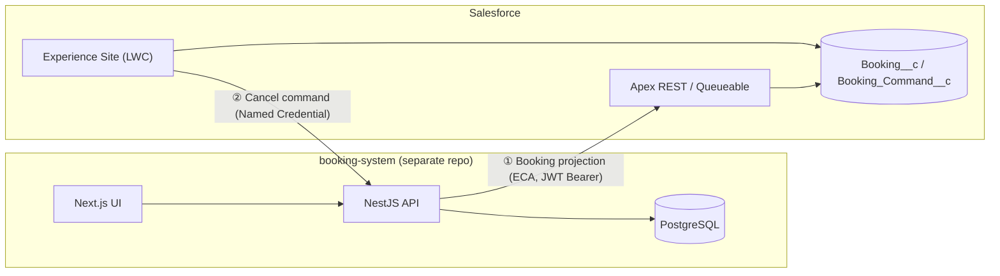

# Salesforce × Booking System External Integration

A repository themed on **Salesforce and external system integration**: a booking system (NestJS / Next.js) integrated with Salesforce **in both directions**, carried through requirements → design → implementation → testing → live verification.

## Screen Gallery

### Experience Cloud site (booking projection list)

The booking projection list on the Experience Site. Bookings eligible for cancellation are highlighted.

### Cancel command flow

When a cancellation is accepted from the site, the processing status transitions from QUEUED to SUCCEEDED, and the booking status is updated to CANCELLED.

**Cancellation accepted (processing status: QUEUED)**

**Processing complete (processing status: SUCCEEDED, booking status updated)**

### booking-side admin console (booking state after sync)

The admin console on the booking system side, reflecting the cancellation result.

### Cancellation notification email (inbox example)

## 1. What this repository demonstrates

- ✅ **Two-way integration** — booking projection (booking → SF) and cancel commands (SF → booking)
- ✅ **Live verification** — 5 browser test items + 8 automated verification items, all passed (**including fault induction → manual recovery**)
- ✅ **Security** — JWT Bearer authentication, idempotent commands, row-level sharing (Sharing Set), CRUD/FLS
- ✅ **Documentation-driven** — 24 documents across three stages (requirements, basic design, detailed design) + a verification coverage ledger

## 2. Architecture

## 3. Three demo scenarios

| # | Scenario | Path | Verified result |
|---|---|---|---|
| ① | Booking projection booking → SF | NestJS → ECA (JWT Bearer) → Apex REST | Canonical changes reflected in `Booking__c`, SYNCED |
| ② | Cancel command SF → booking | Site LWC → Queueable → NC → Guard auth + 5-step validation → version+1 | SUCCEEDED, both sides CANCELLED/v1/SYNCED |
| ③ | Failure & recovery | Tunnel down → HTTP 530×3 → FAILED → RESET DML + re-enqueue (same commandId) | SUCCEEDED, idempotency proven (side effect exactly once) |

## 4. Verification record

| Category | Result |
|---|---|
| Automated verification | **8 items, all passed** (equivalent to MV-04–06, 08–11) |
| Browser live tests | **5 items, all passed** (MV-01/02/03, 07, 08) |
| Unit tests | Apex 36/36 (4 booking classes, aggregate coverage 88.55%) / Backend Jest 273/273 / Frontend Jest 94/94 |
| Failure recovery | Command induced to FAILED → manual retry → SUCCEEDED (idempotency proven) |

## 5. Key resources

### 5.1 Integration core (primary showcase)

| Type | File | Role |
|---|---|---|
| Apex | [BookingProjectionRest.cls](force-app/main/default/classes/BookingProjectionRest.cls) | IF-01 receiver (idempotency, version gate, upsert) |
| Apex | [BookingProjectionDmlHelper.cls](force-app/main/default/classes/BookingProjectionDmlHelper.cls) | Projection DML (explicit system context) |
| Apex | [BookingCommandQueueable.cls](force-app/main/default/classes/BookingCommandQueueable.cls) | IF-02 command execution + result write-back |
| Apex | [BookingSiteController.cls](force-app/main/default/classes/BookingSiteController.cls) | Site LWC backend (list / cancel / polling) |
| Test | [BookingProjectionRestTest](force-app/main/default/classes/BookingProjectionRestTest.cls) / [BookingSiteControllerTest](force-app/main/default/classes/BookingSiteControllerTest.cls) / [BookingCommandQueueableTest](force-app/main/default/classes/BookingCommandQueueableTest.cls) | Unit tests for the 4 classes above |
| LWC | [bookingProjectionList](force-app/main/default/lwc/bookingProjectionList/) | Booking projection list (3-second polling, terminal-state display) |
| Objects | [Booking__c](force-app/main/default/objects/Booking__c/) / [Booking_Command__c](force-app/main/default/objects/Booking_Command__c/) | Canonical snapshot (incl. version-monotonic VR) / command |
| Security | [Booking_Projection_Sharing.sharingSet](force-app/main/default/sharingSets/Booking_Projection_Sharing.sharingSet) / [PermissionSets ×3](force-app/main/default/permissionsets/) | Row-level sharing (per Account) / Site & integration user permissions |
| Integration config | [Named Credential](force-app/main/default/namedCredentials/Booking_Integration_API.namedCredential-meta.xml) / [External Credential](force-app/main/default/externalCredentials/Booking_Integration_Guard.externalCredential-meta.xml) / [ECA](force-app/main/default/externalClientApps/Booking_Integration_API.eca-meta.xml) | IF-02 outbound entry / static Bearer / IF-01 JWT Bearer (Api, RefreshToken) |

### 5.2 Contact Showcase (secondary — two component chains)

| Chain | Resources |
|---|---|
| LWC | [showcaseContactList](force-app/main/default/lwc/showcaseContactList/) / [showcaseContactCreate](force-app/main/default/lwc/showcaseContactCreate/) / [ShowcaseContactController.cls](force-app/main/default/classes/ShowcaseContactController.cls) (+2 Tests) / [ContactCreated channel](force-app/main/default/messageChannels/ContactCreated.messageChannel-meta.xml) (LMS same-page refresh) |
| Aura | [BulkCreateContactQuickAction](force-app/main/default/aura/BulkCreateContactQuickAction/BulkCreateContactQuickAction.cmp) → [BulkCreateComponent](force-app/main/default/aura/BulkCreateComponent/BulkCreateComponent.cmp) → [BulkCreateComponentChild](force-app/main/default/aura/BulkCreateComponentChild/BulkCreateComponentChild.cmp) / [ContactDataController.cls](force-app/main/default/classes/ContactDataController.cls) (+Test, keyset paging / server-side trust boundary) / [EventService](force-app/main/default/aura/EventService/EventService.cmp) (unified Apex gateway + in-table event bus) / [quickActions ×2](force-app/main/default/quickActions/) |

### 5.3 Companion repositories (public on GitHub)

| Repository | Key resources |
|---|---|
| [Cho-Geer/booking-backend](https://github.com/Cho-Geer/booking-backend) | [integrations module](https://github.com/Cho-Geer/booking-backend/tree/develop/src/modules/integrations) (Guard, commands, projection sender) / [integration.guard.ts](https://github.com/Cho-Geer/booking-backend/blob/develop/src/common/guards/integration.guard.ts) / integration [migration p02 (contract)](https://github.com/Cho-Geer/booking-backend/tree/develop/prisma/migrations/20260901180742_p02_contract_version_syncstatus_and_integration_commands) / [p03 (mapping)](https://github.com/Cho-Geer/booking-backend/tree/develop/prisma/migrations/20260903120000_p03_static_operator_mappings) |
| [Cho-Geer/booking-frontend](https://github.com/Cho-Geer/booking-frontend) | [SalesforceWorkbenchEntry.tsx](https://github.com/Cho-Geer/booking-frontend/blob/develop/src/components/molecules/SalesforceWorkbenchEntry.tsx) (3-state gate) / [AdminPage.tsx](https://github.com/Cho-Geer/booking-frontend/blob/develop/src/components/pages/AdminPage.tsx) |

## 6. Design documents (3 stages, 24 documents + ledger)

<b>Requirements definition (8)</b>

- [01 Requirements List](docs/asset/requirement-definition/01_要件一覧.md) (business background & scope)
- [02 NFR List](docs/asset/requirement-definition/02_非機能要件一覧.md) / [03 Business List](docs/asset/requirement-definition/03_業務一覧.md) / [04 Business Flow](docs/asset/requirement-definition/04_業務フロー.md)
- [05 Business Rules](docs/asset/requirement-definition/05_業務ルール一覧.md) / [06 Glossary](docs/asset/requirement-definition/06_用語集.md) / [07 Systemization Scope](docs/asset/requirement-definition/07_システム化範囲.md) / [08 To-Be Model & Issues](docs/asset/requirement-definition/08_ToBe業務モデルと現状課題.md)

<b>Basic design (12)</b>

- [system-architecture](docs/asset/basic-design/system-architecture.md) (overall structure) / [interface-design](docs/asset/basic-design/interface-design.md) (**IF-01/02 contracts**, auth, timeouts, payloads)
- [function-design](docs/asset/basic-design/function-design.md) / [function-list](docs/asset/basic-design/function-list.md) / [screen-items](docs/asset/basic-design/screen-items.md) / [screens](docs/asset/basic-design/screens.md)
- [erd](docs/asset/basic-design/erd.md) / [common-design](docs/asset/basic-design/common-design.md) (permissions & PII policy) / [nonfunctional-design](docs/asset/basic-design/nonfunctional-design.md) / [code-list](docs/asset/basic-design/code-list.md) / [data-migration](docs/asset/basic-design/data-migration.md) / [reports](docs/asset/basic-design/reports.md)

<b>Detailed design (4) + ledger</b>

- [module-design](docs/asset/detailed-design/module-design.md) / [table-definitions](docs/asset/detailed-design/table-definitions.md) / [unit-test-spec](docs/asset/detailed-design/unit-test-spec.md) / [batch-design](docs/asset/detailed-design/batch-design.md)
- Ledger: [coverage-matrix-summary.xlsx](docs/asset/coverage-matrix-summary.xlsx) (**deliverable × verification mapping**, 17 sheets)

## 7. Suggested review path (~10 minutes)

1. [01 Requirements List](docs/asset/requirement-definition/01_要件一覧.md) — business background and scope
2. [interface-design.md](docs/asset/basic-design/interface-design.md) — IF-01/02 contracts (auth, timeouts, payloads)
3. [BookingProjectionRest.cls](force-app/main/default/classes/BookingProjectionRest.cls) — receiving-side implementation (idempotency, version gate)
4. [integration-commands.service.ts](https://github.com/Cho-Geer/booking-backend/blob/develop/src/modules/integrations/integration-commands.service.ts) — sending-side Guard auth + 5-step validation and retry
5. [coverage-matrix-summary.xlsx](docs/asset/coverage-matrix-summary.xlsx) — full deliverable × verification ledger

## 8. Author

**Zixi Tao** — Salesforce & external system integration (design, implementation, testing, failure recovery)
Deploy this repo: `sf project deploy start -o <org-alias>`
Companion repos: [booking-backend](https://github.com/Cho-Geer/booking-backend) / [booking-frontend](https://github.com/Cho-Geer/booking-frontend) (see each repo's README for setup)

---

## 🇯🇵 日本語 | 🇬🇧 English | 🇨🇳 中文

- [日本語](./README.md) / [English](./README.en.md) / [中文](./README.zh.md)
