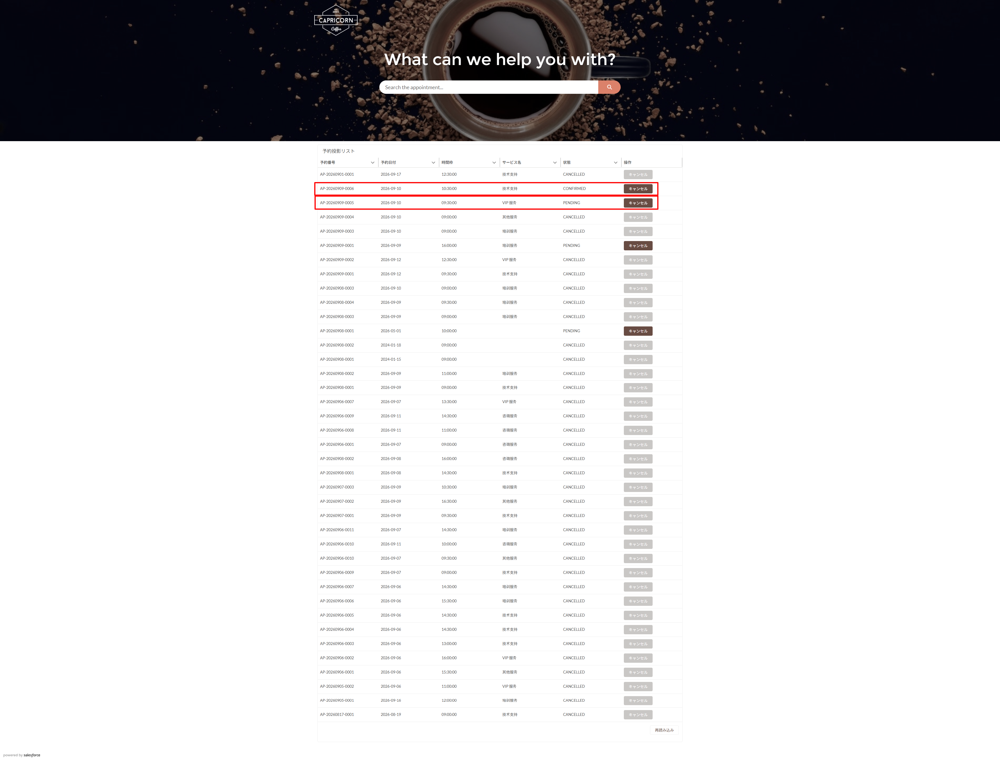
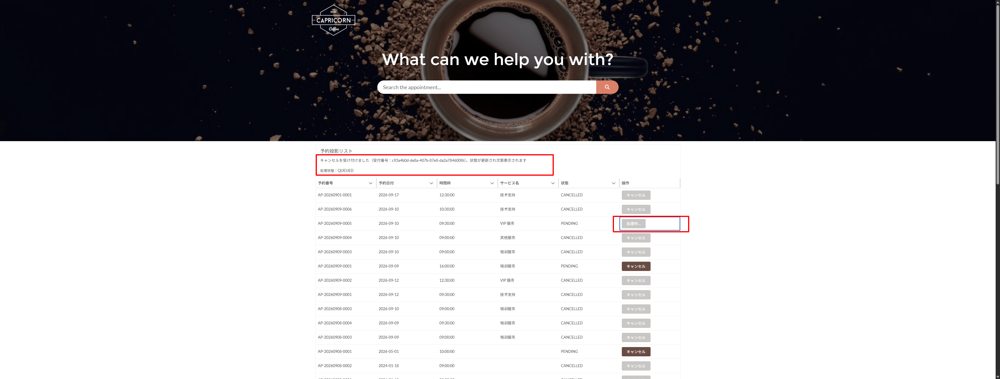
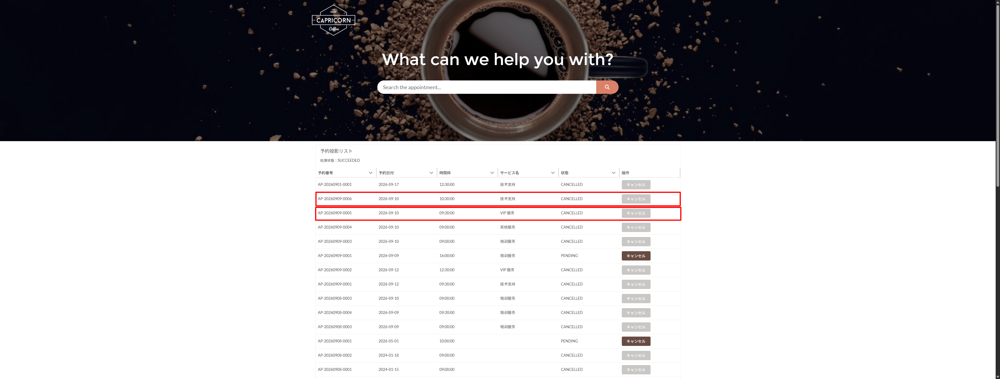
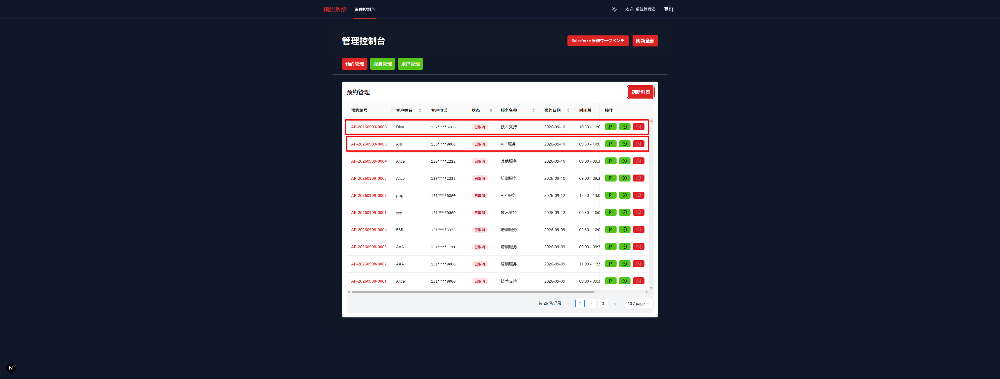
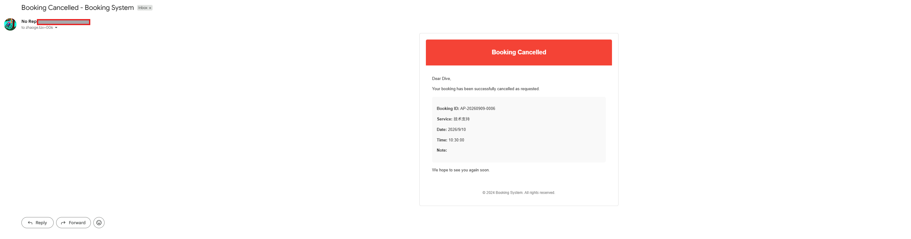
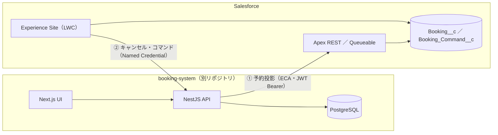

# Salesforce × 予約システム 外部システム連携

**Salesforce および外部システム連携**をテーマにしたリポジトリです。予約システム（NestJS ／ Next.js）と Salesforce を**双方向に連携**させ、要件定義 → 設計 → 実装 → テスト → 実機検証まで一貫して完遂した証跡を、厳選して示します。

## 画面ギャラリー

### Experience Cloud サイト（予約投影リスト）

Experience Site 上の予約投影リスト。キャンセル対象の予約を強調表示しています。

### 予約キャンセルのコマンド連動

サイトからキャンセルを受け付けると処理状態が QUEUED → SUCCEEDED と遷移し、予約ステータスが CANCELLED に更新されます。

**キャンセル受付（処理状態: QUEUED）**

**処理完了（処理状態: SUCCEEDED、予約ステータス更新済み）**

### booking 側管理コンソール（同期後の予約状態）

キャンセル結果が反映された booking システム側の管理コンソールです。

### キャンセル通知メール（受信例）

## 1. このリポジトリで示すこと

- ✅ **双方向連携** — 予約の投影（booking → SF）とキャンセル・コマンド（SF → booking）
- ✅ **実機検証** — ブラウザ実機 5 項目 ＋ 自動化検証 8 項目 全件合格（**障害誘発 → 手動リカバリを含む**）
- ✅ **セキュリティ** — JWT Bearer 認証・冪等コマンド・行レベル共有（Sharing Set）・CRUD/FLS
- ✅ **ドキュメント駆動** — 要件定義／基本設計／詳細設計 3 段階 24 文書 ＋ 検証カバレッジ台帳

## 2. アーキテクチャ

## 3. 3 本のデモシナリオ

| # | シナリオ | 経路 | 検証結果 |
|---|---|---|---|
| ① | 予約投影 booking → SF | NestJS → ECA（JWT Bearer）→ Apex REST | 正本変更が `Booking__c` に反映・SYNCED |
| ② | キャンセル・コマンド SF → booking | Site LWC → Queueable → NC → Guard 認証＋5 重検証 → version+1 | SUCCEEDED・両側 CANCELLED/v1/SYNCED |
| ③ | 障害と復旧 | トンネル切断 → HTTP 530×3 → FAILED → RESET DML ＋ 再 enqueue（同一 commandId） | SUCCEEDED・冪等（副作用 1 回）実証 |

## 4. 検証実績

| 区分 | 結果 |
|---|---|
| 自動化検証 | **8 項目全件合格**（MV-04〜06・08〜11 相当） |
| ブラウザ実機 | **5 項目全件合格**（MV-01/02/03・07・08） |
| 単体テスト | Apex 36/36（booking 系 4 クラス・集計カバー率 88.55%）・Backend Jest 273/273・Frontend Jest 94/94 |
| 障害リカバリ | コマンド FAILED 誘発 → 手動リトライ → SUCCEEDED（冪等実証） |

## 5. 主要リソース

### 5.1 連携コア（主展示）

| 種別 | ファイル | 役割 |
|---|---|---|
| Apex | [BookingProjectionRest.cls](force-app/main/default/classes/BookingProjectionRest.cls) | IF-01 受信（冪等・バージョンゲート・upsert） |
| Apex | [BookingProjectionDmlHelper.cls](force-app/main/default/classes/BookingProjectionDmlHelper.cls) | 投影 DML（明示 system context） |
| Apex | [BookingCommandQueueable.cls](force-app/main/default/classes/BookingCommandQueueable.cls) | IF-02 コマンド実行＋結果書戻 |
| Apex | [BookingSiteController.cls](force-app/main/default/classes/BookingSiteController.cls) | Site LWC バックエンド（一覧／キャンセル／ポーリング） |
| Test | [BookingProjectionRestTest](force-app/main/default/classes/BookingProjectionRestTest.cls)・[BookingSiteControllerTest](force-app/main/default/classes/BookingSiteControllerTest.cls)・[BookingCommandQueueableTest](force-app/main/default/classes/BookingCommandQueueableTest.cls) | 上記 4 クラスの単体テスト |
| LWC | [bookingProjectionList](force-app/main/default/lwc/bookingProjectionList/) | 予約投影リスト（3 秒ポーリング・終態表示） |
| オブジェクト | [Booking__c](force-app/main/default/objects/Booking__c/) ／ [Booking_Command__c](force-app/main/default/objects/Booking_Command__c/) | 投影正本スナップショット（バージョン単調性 VR 含む） ／ コマンド |
| セキュリティ | [Booking_Projection_Sharing.sharingSet](force-app/main/default/sharingSets/Booking_Projection_Sharing.sharingSet) ／ [PermissionSet ×3](force-app/main/default/permissionsets/) | 行レベル共有（Account 単位）・Site/統合ユーザー権限 |
| 連携設定 | [Named Credential](force-app/main/default/namedCredentials/Booking_Integration_API.namedCredential-meta.xml)・[External Credential](force-app/main/default/externalCredentials/Booking_Integration_Guard.externalCredential-meta.xml)・[ECA](force-app/main/default/externalClientApps/Booking_Integration_API.eca-meta.xml) | IF-02 送信入口・静的 Bearer・IF-01 JWT Bearer（Api, RefreshToken） |

### 5.2 Contact Showcase（第二展示・2 本のコンポーネントチェーン）

| チェーン | リソース |
|---|---|
| LWC | [showcaseContactList](force-app/main/default/lwc/showcaseContactList/)・[showcaseContactCreate](force-app/main/default/lwc/showcaseContactCreate/)・[ShowcaseContactController.cls](force-app/main/default/classes/ShowcaseContactController.cls)（＋Test×2）・[ContactCreated チャネル](force-app/main/default/messageChannels/ContactCreated.messageChannel-meta.xml)（LMS 同期更新） |
| Aura | [BulkCreateContactQuickAction](force-app/main/default/aura/BulkCreateContactQuickAction/BulkCreateContactQuickAction.cmp) → [BulkCreateComponent](force-app/main/default/aura/BulkCreateComponent/BulkCreateComponent.cmp) → [BulkCreateComponentChild](force-app/main/default/aura/BulkCreateComponentChild/BulkCreateComponentChild.cmp)・[ContactDataController.cls](force-app/main/default/classes/ContactDataController.cls)（＋Test・keyset ページング／サーバー側信頼境界）・[EventService](force-app/main/default/aura/EventService/EventService.cmp)（Apex 統一出口＋表内イベントバス）・[quickActions ×2](force-app/main/default/quickActions/) |

### 5.3 連携先リポジトリ（GitHub 公開）

| リポジトリ | 主要リソース |
|---|---|
| [Cho-Geer/booking-backend](https://github.com/Cho-Geer/booking-backend) | [integrations モジュール](https://github.com/Cho-Geer/booking-backend/tree/develop/src/modules/integrations)（Guard・コマンド・投影送信）・[integration.guard.ts](https://github.com/Cho-Geer/booking-backend/blob/develop/src/common/guards/integration.guard.ts)・連携 [migration p02（契約）](https://github.com/Cho-Geer/booking-backend/tree/develop/prisma/migrations/20260901180742_p02_contract_version_syncstatus_and_integration_commands)・[p03（マッピング）](https://github.com/Cho-Geer/booking-backend/tree/develop/prisma/migrations/20260903120000_p03_static_operator_mappings) |
| [Cho-Geer/booking-frontend](https://github.com/Cho-Geer/booking-frontend) | [SalesforceWorkbenchEntry.tsx](https://github.com/Cho-Geer/booking-frontend/blob/develop/src/components/molecules/SalesforceWorkbenchEntry.tsx)（3 状態ゲート）・[AdminPage.tsx](https://github.com/Cho-Geer/booking-frontend/blob/develop/src/components/pages/AdminPage.tsx) |

## 6. 設計ドキュメント（3 段階 24 文書＋台帳）

<b>要件定義（8 件）</b>

- [01_要件一覧](docs/asset/requirement-definition/01_要件一覧.md)（ビジネス背景・スコープ）
- [02_非機能要件一覧](docs/asset/requirement-definition/02_非機能要件一覧.md)・[03_業務一覧](docs/asset/requirement-definition/03_業務一覧.md)・[04_業務フロー](docs/asset/requirement-definition/04_業務フロー.md)
- [05_業務ルール一覧](docs/asset/requirement-definition/05_業務ルール一覧.md)・[06_用語集](docs/asset/requirement-definition/06_用語集.md)・[07_システム化範囲](docs/asset/requirement-definition/07_システム化範囲.md)・[08_ToBe業務モデルと現状課題](docs/asset/requirement-definition/08_ToBe業務モデルと現状課題.md)

<b>基本設計（12 件）</b>

- [system-architecture](docs/asset/basic-design/system-architecture.md)（全体構成）・[interface-design](docs/asset/basic-design/interface-design.md)（**IF-01/02 契約**・タイムアウト・認証・ペイロード）
- [function-design](docs/asset/basic-design/function-design.md)・[function-list](docs/asset/basic-design/function-list.md)・[screen-items](docs/asset/basic-design/screen-items.md)・[screens](docs/asset/basic-design/screens.md)
- [erd](docs/asset/basic-design/erd.md)・[common-design](docs/asset/basic-design/common-design.md)（権限・PII 方針）・[nonfunctional-design](docs/asset/basic-design/nonfunctional-design.md)・[code-list](docs/asset/basic-design/code-list.md)・[data-migration](docs/asset/basic-design/data-migration.md)・[reports](docs/asset/basic-design/reports.md)

<b>詳細設計（4 件）＋ 台帳</b>

- [module-design](docs/asset/detailed-design/module-design.md)・[table-definitions](docs/asset/detailed-design/table-definitions.md)・[unit-test-spec](docs/asset/detailed-design/unit-test-spec.md)・[batch-design](docs/asset/detailed-design/batch-design.md)
- 台帳：[coverage-matrix-summary.xlsx](docs/asset/coverage-matrix-summary.xlsx)（**成果物 × 検証の対応台帳**・17 シート）

## 7. 推奨レビュー順（約 10 分）

1. [01_要件一覧](docs/asset/requirement-definition/01_要件一覧.md) — ビジネス背景とスコープ
2. [interface-design.md](docs/asset/basic-design/interface-design.md) — IF-01/02 契約（認証・タイムアウト・ペイロード）
3. [BookingProjectionRest.cls](force-app/main/default/classes/BookingProjectionRest.cls) — 受信側実装（冪等・バージョンゲート）
4. [integration-commands.service.ts](https://github.com/Cho-Geer/booking-backend/blob/develop/src/modules/integrations/integration-commands.service.ts) — 送信側 Guard 認証＋5 重検証とリトライ
5. [coverage-matrix-summary.xlsx](docs/asset/coverage-matrix-summary.xlsx) — 成果物 × 検証の全容

## 8. 作者

**Zixi Tao** — Salesforce／外部システム連携領域（設計・実装・テスト・障害対応）
本リポジトリのデプロイ: `sf project deploy start -o <org-alias>`
関連リポジトリ：[booking-backend](https://github.com/Cho-Geer/booking-backend)・[booking-frontend](https://github.com/Cho-Geer/booking-frontend)（起動手順は各リポジトリ README 参照）

---

## 🇯🇵 日本語 | 🇬🇧 English | 🇨🇳 中文

- [日本語](./README.md) / [English](./README.en.md) / [中文](./README.zh.md)
