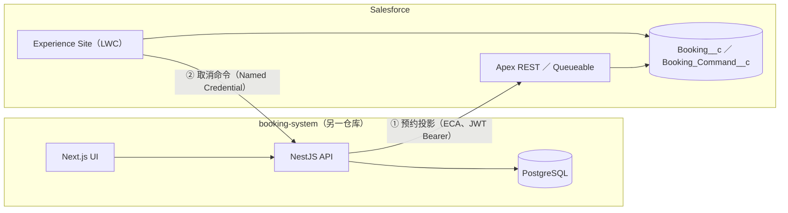

# Salesforce × 预约系统 外部系统集成

以 **Salesforce 与外部系统集成**为主题的仓库：将预约系统（NestJS／Next.js）与 Salesforce **双向集成**，从需求定义 → 设计 → 实现 → 测试 → 实机验证一贯到底。

## 1. 本仓库展示什么

- ✅ **双向集成** — 预约投影（booking → SF）与取消命令（SF → booking）
- ✅ **实机验证** — 浏览器实机 5 项 ＋ 自动化验证 8 项 全部合格（**含故障诱发 → 手动恢复**）
- ✅ **安全** — JWT Bearer 认证、幂等命令、行级共享（Sharing Set）、CRUD/FLS
- ✅ **文档驱动** — 需求定义／基本设计／详细设计三阶段 24 份文档 ＋ 验证覆盖台账

## 2. 架构

## 3. 三条演示场景

| # | 场景 | 路径 | 验证结果 |
|---|---|---|---|
| ① | 预约投影 booking → SF | NestJS → ECA（JWT Bearer）→ Apex REST | 正本变更反映到 `Booking__c`、SYNCED |
| ② | 取消命令 SF → booking | Site LWC → Queueable → NC → Guard 认证＋五重校验 → version+1 | SUCCEEDED、两侧 CANCELLED/v1/SYNCED |
| ③ | 故障与恢复 | 隧道中断 → HTTP 530×3 → FAILED → RESET DML＋再入队（同一 commandId） | SUCCEEDED、幂等（副作用恰好 1 次）实证 |

## 4. 验证成果

| 区分 | 结果 |
|---|---|
| 自动化验证 | **8 项全部合格**（相当于 MV-04～06、08～11） |
| 浏览器实机 | **5 项全部合格**（MV-01/02/03、07、08） |
| 单元测试 | Apex 36/36（booking 系 4 类、聚合覆盖率 88.55%）、Backend Jest 273/273、Frontend Jest 94/94 |
| 故障恢复 | 命令诱发 FAILED → 手动重试 → SUCCEEDED（幂等实证） |

## 5. 主要资源

### 5.1 集成核心（主展示）

| 类型 | 文件 | 职责 |
|---|---|---|
| Apex | [BookingProjectionRest.cls](force-app/main/default/classes/BookingProjectionRest.cls) | IF-01 接收端（幂等、版本门、upsert） |
| Apex | [BookingProjectionDmlHelper.cls](force-app/main/default/classes/BookingProjectionDmlHelper.cls) | 投影 DML（明示 system context） |
| Apex | [BookingCommandQueueable.cls](force-app/main/default/classes/BookingCommandQueueable.cls) | IF-02 命令执行＋结果写回 |
| Apex | [BookingSiteController.cls](force-app/main/default/classes/BookingSiteController.cls) | Site LWC 后端（一览／取消／轮询） |
| 测试 | [BookingProjectionRestTest](force-app/main/default/classes/BookingProjectionRestTest.cls)、[BookingSiteControllerTest](force-app/main/default/classes/BookingSiteControllerTest.cls)、[BookingCommandQueueableTest](force-app/main/default/classes/BookingCommandQueueableTest.cls) | 上述 4 类的单元测试 |
| LWC | [bookingProjectionList](force-app/main/default/lwc/bookingProjectionList/) | 预约投影列表（3 秒轮询、终态显示） |
| 对象 | [Booking__c](force-app/main/default/objects/Booking__c/) ／ [Booking_Command__c](force-app/main/default/objects/Booking_Command__c/) | 投影正本快照（含版本单调性 VR）／ 命令 |
| 安全 | [Booking_Projection_Sharing.sharingSet](force-app/main/default/sharingSets/Booking_Projection_Sharing.sharingSet) ／ [PermissionSet ×3](force-app/main/default/permissionsets/) | 行级共享（按 Account）、Site／集成用户权限 |
| 集成配置 | [Named Credential](force-app/main/default/namedCredentials/Booking_Integration_API.namedCredential-meta.xml)、[External Credential](force-app/main/default/externalCredentials/Booking_Integration_Guard.externalCredential-meta.xml)、[ECA](force-app/main/default/externalClientApps/Booking_Integration_API.eca-meta.xml) | IF-02 发送入口、静态 Bearer、IF-01 JWT Bearer（Api, RefreshToken） |

### 5.2 Contact Showcase（次要展示、两条组件链）

| 链 | 资源 |
|---|---|
| LWC | [showcaseContactList](force-app/main/default/lwc/showcaseContactList/)、[showcaseContactCreate](force-app/main/default/lwc/showcaseContactCreate/)、[ShowcaseContactController.cls](force-app/main/default/classes/ShowcaseContactController.cls)（＋测试×2）、[ContactCreated 通道](force-app/main/default/messageChannels/ContactCreated.messageChannel-meta.xml)（LMS 同页刷新） |
| Aura | [BulkCreateContactQuickAction](force-app/main/default/aura/BulkCreateContactQuickAction/BulkCreateContactQuickAction.cmp) → [BulkCreateComponent](force-app/main/default/aura/BulkCreateComponent/BulkCreateComponent.cmp) → [BulkCreateComponentChild](force-app/main/default/aura/BulkCreateComponentChild/BulkCreateComponentChild.cmp)、[ContactDataController.cls](force-app/main/default/classes/ContactDataController.cls)（＋测试、keyset 分页／服务端信任边界）、[EventService](force-app/main/default/aura/EventService/EventService.cmp)（Apex 统一出口＋表内事件总线）、[quickActions ×2](force-app/main/default/quickActions/) |

### 5.3 连携仓库（GitHub 公开）

| 仓库 | 主要资源 |
|---|---|
| [Cho-Geer/booking-backend](https://github.com/Cho-Geer/booking-backend) | [integrations 模块](https://github.com/Cho-Geer/booking-backend/tree/develop/src/modules/integrations)（Guard、命令、投影发送）、[integration.guard.ts](https://github.com/Cho-Geer/booking-backend/blob/develop/src/common/guards/integration.guard.ts)、集成 [migration p02（契约）](https://github.com/Cho-Geer/booking-backend/tree/develop/prisma/migrations/20260901180742_p02_contract_version_syncstatus_and_integration_commands)、[p03（映射）](https://github.com/Cho-Geer/booking-backend/tree/develop/prisma/migrations/20260903120000_p03_static_operator_mappings) |
| [Cho-Geer/booking-frontend](https://github.com/Cho-Geer/booking-frontend) | [SalesforceWorkbenchEntry.tsx](https://github.com/Cho-Geer/booking-frontend/blob/develop/src/components/molecules/SalesforceWorkbenchEntry.tsx)（3 状态门控）、[AdminPage.tsx](https://github.com/Cho-Geer/booking-frontend/blob/develop/src/components/pages/AdminPage.tsx) |

## 6. 设计文档（三阶段 24 份＋台账）

<b>需求定义（8 份）</b>

- [01 需求一览](docs/asset/requirement-definition/01_要件一覧.md)（业务背景与范围）
- [02 非功能需求一览](docs/asset/requirement-definition/02_非機能要件一覧.md)、[03 业务一览](docs/asset/requirement-definition/03_業務一覧.md)、[04 业务流程](docs/asset/requirement-definition/04_業務フロー.md)
- [05 业务规则一览](docs/asset/requirement-definition/05_業務ルール一覧.md)、[06 用语集](docs/asset/requirement-definition/06_用語集.md)、[07 系统化范围](docs/asset/requirement-definition/07_システム化範囲.md)、[08 ToBe 业务模型与现状课题](docs/asset/requirement-definition/08_ToBe業務モデルと現状課題.md)

<b>基本设计（12 份）</b>

- [system-architecture](docs/asset/basic-design/system-architecture.md)（整体构成）、[interface-design](docs/asset/basic-design/interface-design.md)（**IF-01/02 契约**、认证、超时、载荷）
- [function-design](docs/asset/basic-design/function-design.md)、[function-list](docs/asset/basic-design/function-list.md)、[screen-items](docs/asset/basic-design/screen-items.md)、[screens](docs/asset/basic-design/screens.md)
- [erd](docs/asset/basic-design/erd.md)、[common-design](docs/asset/basic-design/common-design.md)（权限与 PII 方针）、[nonfunctional-design](docs/asset/basic-design/nonfunctional-design.md)、[code-list](docs/asset/basic-design/code-list.md)、[data-migration](docs/asset/basic-design/data-migration.md)、[reports](docs/asset/basic-design/reports.md)

<b>详细设计（4 份）＋ 台账</b>

- [module-design](docs/asset/detailed-design/module-design.md)、[table-definitions](docs/asset/detailed-design/table-definitions.md)、[unit-test-spec](docs/asset/detailed-design/unit-test-spec.md)、[batch-design](docs/asset/detailed-design/batch-design.md)
- 台账：[coverage-matrix-summary.xlsx](docs/asset/coverage-matrix-summary.xlsx)（**交付物 × 验证对照台账**、17 个工作表）

## 7. 推荐审阅顺序（约 10 分钟）

1. [01 需求一览](docs/asset/requirement-definition/01_要件一覧.md) — 业务背景与范围
2. [interface-design.md](docs/asset/basic-design/interface-design.md) — IF-01/02 契约（认证、超时、载荷）
3. [BookingProjectionRest.cls](force-app/main/default/classes/BookingProjectionRest.cls) — 接收端实现（幂等、版本门）
4. [integration-commands.service.ts](https://github.com/Cho-Geer/booking-backend/blob/develop/src/modules/integrations/integration-commands.service.ts) — 发送端 Guard 认证＋五重校验与重试
5. [coverage-matrix-summary.xlsx](docs/asset/coverage-matrix-summary.xlsx) — 交付物 × 验证全貌

## 8. 作者

**Zixi Tao** — Salesforce／外部系统集成领域（设计、实现、测试、故障处理）
本仓库部署：`sf project deploy start -o <org-alias>`
关联仓库：[booking-backend](https://github.com/Cho-Geer/booking-backend)、[booking-frontend](https://github.com/Cho-Geer/booking-frontend)（启动步骤见各仓库 README）

---

## 🇯🇵 日本語 | 🇬🇧 English | 🇨🇳 中文

- [日本語](./README.md) / [English](./README.en.md) / [中文](./README.zh.md)
