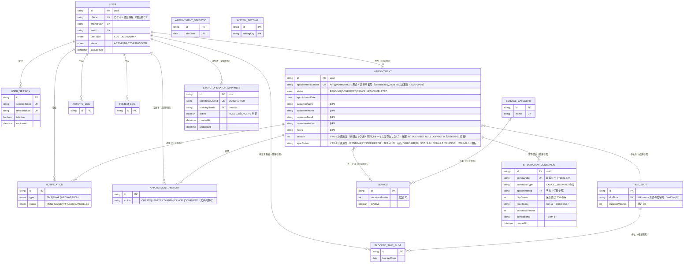
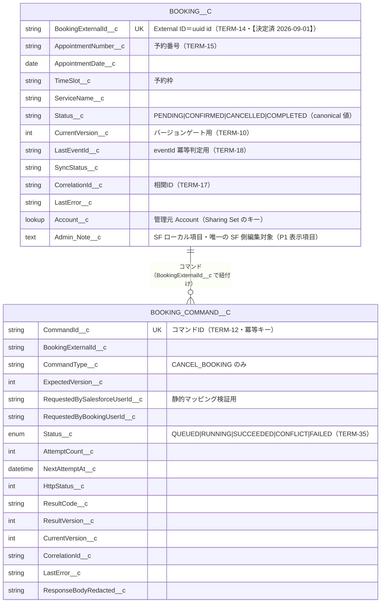

# エンティティ関連図（ERD・基本設計）

| 項目 | 内容 |
|---|---|
| 文書ID | BD-07 |
| 版数 | V2.0（ドラフト・日本語化・雛形準拠） |
| 作成日 | 2026-08-31 |
| 対象 | Booking × Salesforce Experience Cloud 連携（基本設計フェーズ・データモデル） |

## 1. 文書の位置づけと雛形対応

- 本書は P0-2 基本設計四文書の一つ（BD-07）。Booking 側 ERD は `booking-backend/prisma/schema.prisma` の実測（13 モデル・2026-08-31 読取）を基準とし、Salesforce 側は P0-2 計画オブジェクト（🔵 未実装・項目一覧は契約凍結済み（2026-09-01））を記載する。機能は BD-02（function-list.md）、構成は BD-01（system-architecture.md）を参照。
- 雛形対応（交付物雛形集 4.8 ER 図の 9 項目）：エンティティ名・物理名候補・主要属性・関連先・カーディナリティ＝§2・§3 の図と表／定義・役割＝§2.1 のエンティティ一覧表／主キー＝全モデル共通で uuid の `id`（§2.1）／親子依存・削除制約＝§4（新設）／履歴・世代管理要否＝§4.2。物理型・長さ・インデックス・DDL は詳細設計（テーブル定義書）に属するため本書では扱わない（スキーマ実測値の引用注記を除く）。
- 図例：実線 = 既存のリレーション（✅）。`//` で始まる注記 = P0-2 計画の増分（🔵）。🔒 = PII フィールド（投影ホワイトリスト除外・TERM-29）。

## 2. Booking 側 ERD（✅ 実測＋🔵 P0-2 計画増分）

### 2.1 エンティティ一覧（雛形項目：エンティティ名／物理名候補／定義・役割／主キー）

| エンティティ名 | 物理名（schema.prisma 実測） | 定義・役割 | 主キー |
|---|---|---|---|
| ユーザー | `User`（users） | 顧客（CUSTOMER・TERM-05）と管理者（ADMIN・TERM-06）のアカウント。電話番号がログイン認証情報 | `id`（uuid） |
| ユーザーセッション | `UserSession`（user_sessions） | JWT セッションの記録。状態変更時のセッション取消（RULE-17）の対象 | `id`（uuid） |
| 予約（正本・TERM-08） | `Appointment`（appointments） | 予約状態の唯一の権威あるデータ。顧客情報のスナップショット項目を持つ | `id`（uuid） |
| 予約枠 | `TimeSlot`（time_slots） | 予約可能な日時単位。実効容量 1（TERM-02・RULE-06） | `id`（uuid） |
| サービス | `Service`（services） | 予約対象の提供メニュー（TERM-03） | `id`（uuid） |
| サービスカテゴリ | `ServiceCategory`（service_categories） | サービスの分類マスタ（TERM-04） | `id`（uuid） |
| 予約履歴 | `AppointmentHistory`（appointment_history） | 予約状態変更の履歴管理用モデル（§4.2 参照） | `id`（uuid） |
| 通知 | `Notification`（notifications） | サイト内通知（F-09） | `id`（uuid） |
| 予約枠停止 | `BlockedTimeSlot`（blocked_time_slots） | 枠の停止記録。モデルは在るが端点未実装（既知課題） | `id`（uuid） |
| アクティビティログ | `ActivityLog`（activity_logs） | 利用者操作の記録 | `id`（uuid） |
| システムログ | `SystemLog`（system_logs） | システム動作の記録 | `id`（uuid） |
| 予約統計 | `AppointmentStatistic`（appointment_statistics） | 日次統計（F-10 の統計サマリとは別の集計テーブル） | `id`（uuid） |
| システム設定 | `SystemSetting`（system_settings） | 設定キー・バリューの保存。`SystemModule` 未インポートのため端点からは不可用 | `id`（uuid） |
| コマンド冪等結果（第 14 モデル・✅ 実装済） | `IntegrationCommand`（integration_commands） | 統合コマンドの初回受理結果（200 のみ）を保存する冪等キーテーブル（DD-01 §2.15・migration 20260901180742・2026-09-02） | `id`（uuid） |
| 操作者静的マッピング（第 15 モデル・✅ 実装済） | `StaticOperatorMapping`（static_operator_mappings） | Salesforce ユーザーと Booking ユーザーの静的対応。RULE-12 の操作者検証入力（DD-01 §2.16・migration 20260903120000・2026-09-03） | `id`（uuid） |

### 2.2 ER 図

**現状要点（実測）**：全 13 モデルに version／楽観ロック用フィールドは存在しない。salesforce／experience に関するフィールドも存在しない。`Appointment.customerPhone` のスキーマコメントは暗号化保存を示唆するが、既存の読取調査（2026-08-31）では平文保存・応答層のみマスクと報告されている。🔒 の 5 項目（TERM-29・氏名・電話・メール・WeChat・備考）はいずれも投影ホワイトリスト外。ユーザーのロール（userType）変更は既存セッションを維持し、status 変更は取消す（ブラックリスト方式・RULE-17）。

**追記（第 14＝71c88c8・2026-09-02〔migration 20260901180742〕／第 15＝8581f50・2026-09-03〔migration 20260903120000〕）**：第 14 モデル `IntegrationCommand`（integration_commands・migration 20260901180742・71c88c8・2026-09-02）と第 15 モデル `StaticOperatorMapping`（static_operator_mappings・migration 20260903120000・8581f50・2026-09-03）が追加され、Booking 側スキーマは 15 モデルとなった（詳細は DD-01 §2.15・§2.16）。

## 3. Salesforce 側オブジェクト（🔵 P0-2 契約凍結・項目は計画値）

**境界制約**：`Booking__c` の canonical 項目は投影入口（Apex・TERM-24）のみが書込可能。Queueable（TERM-22）が更新するのは `Booking_Command__c` の状態のみで、正本の canonical 状態を直接書かない。両オブジェクトは External OWD=Private＋Sharing Set により `Account__c` 単位で隔離（TERM-32・REQ-030）。PII は `Booking__c` に一切出現しない（RULE-11）。External ID は 2026-09-01 に uuid `id` と決定済み（TERM-14・【決定済 2026-09-01】）。上表の 2 項目を同時に External ID にはしない。

## 4. 削除制約・履歴管理（新設・雛形項目「親子依存・削除制約」「履歴・世代管理要否」に対応）

### 4.1 親子依存と削除制約

schema.prisma で**明示指定されている連鎖削除（onDelete: Cascade）**は次の 4 本のみ（実測）。

| 親 | 子 | 明示された削除動作 | 出典 |
|---|---|---|---|
| User | UserSession | 親ユーザー削除時にセッションを連鎖削除 | `UserSession.user` の `onDelete: Cascade` |
| Appointment | AppointmentHistory | 予約削除時に履歴を連鎖削除 | `AppointmentHistory.appointment` の `onDelete: Cascade` |
| User | Notification | ユーザー削除時に通知を連鎖削除 | `Notification.user` の `onDelete: Cascade` |
| Appointment | Notification | 予約削除時に通知を連鎖削除 | `Notification.appointment` の `onDelete: Cascade` |

上記以外のリレーション（例：`Appointment.user`（任意）・`Appointment.timeSlot`（必須）・`Appointment.service`（任意）・`AppointmentHistory.changedBy`（任意）・`BlockedTimeSlot`／`ActivityLog`／`SystemLog` の各ユーザー参照）には schema.prisma 上の明示された onDelete 指定がない。実 DB 削除挙動は 2026-09-01 pg_constraint 実測済み（明示 Cascade 4 本・SET NULL 8 本・RESTRICT 1 本。詳細は DD-01 §5.1 クローズ記録・DD-01 §2.14 参照）。本書では推定記載を行わない方針は維持する。

なお、`DELETE /v1/users/:id`（管理者機能・F-12）が `Appointment.user` 参照に与える影響は、上記実測（appointments.user_id＝SET NULL）でカバー済みであり、別途の確認事項ではない。

### 4.2 履歴管理（実装済みの事実と限界）

- `AppointmentHistory` は履歴管理用モデルとして**実装済み**である（action／previousStatus／newStatus／changedBy／changeReason／metadata を保持）。
- ただし既知の事実として、**実装上の書込み経路が存在しない**（RD-01 REQ-031 の備考と一致）。したがって連携監査には本テーブルを用いず、`Booking_Command__c` 側の監査フィールド（CorrelationId・AttemptCount・HttpStatus・NextAttemptAt・LastError）で担保する（✅ 実装済・Booking_Command__c 書込は Queueable〔44d215d〕・Booking__c 書込は投影入口〔6b9d970〕・2026-09-02/09-03）。
- 世代管理（有効期間・世代番号方式）は採用していない。バージョン管理が必要な連携領域は `version` フィールド（🔵 P0-2 計画増分・TERM-10）が担う。

### 4.3 30 日保持・ハードデリート（BIZ-16・RULE-15・REQ-032 対応 ✅）

- retention モジュール（既存実装）が、`CANCELLED`（`cancelledAt` 基準・null の場合は `updatedAt`）および `COMPLETED`（`completedAt` 基準・null の場合は `updatedAt`）の予約を、**状態確定から 30 日経過後にハードデリート**する（`RETENTION_DAYS` 既定 30・保持日数は RULE-15 のパラメータ化対象）。
- 実装方式（実測）：Prisma の `deleteMany` による**物理削除**。バッチ既定 500 件・バッチ間スリープ 200ms・dry-run モードあり。スケジューラによる周期実行＋手動実行スクリプト（NFR-11 の月次目視確認は運用側で実施）。
- 削除対象の予約に Cascade で紐づく `AppointmentHistory`・`Notification` も連鎖削除される（§4.1 の明示 Cascade による）。
- 投影レコード（`Booking__c`）は正本クリーンアップの対象外とし、削除済み予約への遅延コマンドは 404/409 で判定可能な応答とする（G7 決定事項・REQ-033 🔵）。

### 4.4 論理削除なし（物理削除）の明記

- 13 モデルのいずれにも `deletedAt` 等の論理削除フラグは存在しない（schema.prisma 実測）。
- `DELETE /v1/bookings/:id`・`DELETE /v1/users/:id` はハード削除（api-contract.md 実測・HTTP 204）。
- retention も物理削除（§4.3）。よって本システムの削除は**原則として物理削除**であり、論理削除は採用しない方針である。この方針はほぼすべての照会系処理（一覧・統計・空き判定）に影響するため、基本設計の段階で明示する（雛形 4.8 の記載要点に対応）。

## 5. 既存の一致性・失敗設計との接続

- 楽観的排他：Booking 側は現状データベーストランザクションの行ロックに依存（予約作成フローに P2034 の直列化リトライあり）。システム間連携では明示的な `version` フィールド（🔵 P0-2 migration）が必要であり、これは ERD レベルで唯一のスキーマ増分である（`syncStatus` と合わせて 2 項目・NFR-13）。
- 監査：`AppointmentHistory` テーブルは存在するが書込み経路なし（§4.2）。連携監査は `Booking_Command__c`（attempt／error／correlation）に依存する（✅ 実装済・2026-09-02/09-03）。
- retention の 30 日ハードデリート（CANCELLED/COMPLETED）：投影レコードは削除対象外・遅延コマンドは 404/409 でフォールバック（G7・P0-2 決定記録項目・REQ-033）。
- PII ガバナンスの盲点（現状記録・投影ホワイトリストの問題ではない）：`bookings.service.ts:243` で顧客電話番号をアプリケーションログへ平文出力している（既存読取調査 2026-08-31）。**2026-09-01 P0-2 契約内でマスキング適用・是正済み**（ガバナンス一覧へ組み入れ済み）。

## 6. 未決事項

| No. | 未決事項 | 決定期限 |
|---|---|---|
| 1 | 【決定済 2026-09-01】uuid `id` に決定（TERM-14・DD-01 §5 未決 1 と同日クローズ） | 決定済み（2026-09-01） |
| 2 | 【型決定済 2026-09-01】`version`＝INTEGER NOT NULL DEFAULT 0・`syncStatus`＝VARCHAR(16) NOT NULL DEFAULT 'PENDING'。**migration 実施自体は未実施**（CHK-01 B-1・P0-2 契約凍結後） | P0-2 契約凍結後 |
| 3 | 【クローズ 2026-09-01・実測確認済】DD-01 §5 未決 3 に統合・クローズ（pg_constraint 実測：SET NULL 8 本／RESTRICT 1 本。クローズ記録は DD-01 §5.1 参照） | 決定済み（2026-09-01） |
