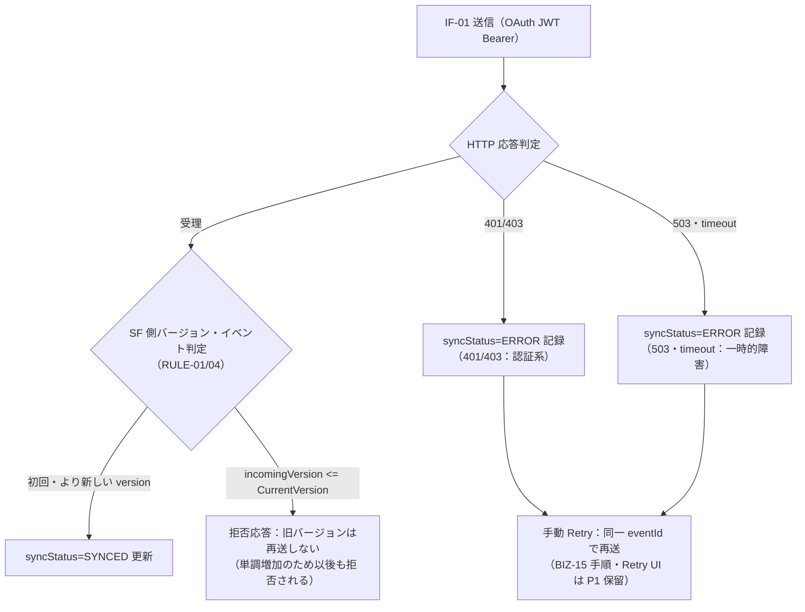

# インターフェース設計書（基本設計）

| 項目 | 内容 |
|---|---|
| 文書ID | BD-09 |
| 版数 | V1.0（ドラフト・雛形準拠） |
| 作成日 | 2026-08-31 |
| 対象 | Booking × Salesforce Experience Cloud 連携（基本設計フェーズ・I/F 設計） |

## 1. 文書の位置づけと雛形対応

- 本書は基本設計八文書の一つ（BD-09）。外部システム（Booking System ⇔ Salesforce）間の I/F を 2 本だけ定義する：**IF-01 予約投影（Booking → Salesforce）** と **IF-02 予約キャンセルコマンド（Salesforce → Booking）**。
- 雛形（交付物雛形集 4.10 インターフェース設計書）の 10 項目＝各 I/F 章の節構成：I/F ID・連携先／方向／方式／項目一覧／頻度・タイミング／データ量／コード変換／異常時処理／担当・責任分界／連絡体制。
- I/F の事実源は `docs/asset/requirement-definition-draft/interview-portfolio-business-sequence.md`（§2 主時序・§3 異常時序）および `docs/asset/requirement-definition-draft/interview-portfolio-business-flow.md`（F3/F4/F5）である。構成は BD-01（system-architecture.md §3.5・§4 認証境界 A2/A3）、データモデルは BD-07（erd.md §3）に準拠する。
- **状態の真実性**：両 I/F とも「**P0-3 計画・未着手**」である。IF-02 の Booking 側受入エンドポイント（`POST /v1/integrations/salesforce/booking-commands`）は現状**未実装**であり、Booking の `package.json` に HTTP クライアント／OAuth 依存も存在しない（BD-01 §1 実測と一致）。本書の項目値は設計値（未実装）であり、P0-2 契約凍結で最終確定する。

## 2. I/F 一覧

| I/F ID | I/F 名 | 方向 | 連携先 | 認証 | 対応機能 | 状態 |
|---|---|---|---|---|---|---|
| IF-01 | 予約投影 | 送信（Booking → Salesforce） | chogeer DE org・Apex REST `BookingProjectionRest`（TERM-24） | OAuth 2.0 JWT Bearer（Connected App・A2） | F-20 | 🔵 P0-3 計画・未着手 |
| IF-02 | 予約キャンセルコマンド | 送信（Salesforce → Booking） | Booking 統合端点 `POST /v1/integrations/salesforce/booking-commands` | Named Credential（Bearer secret）＋ Integration Guard（A3） | F-25 | 🔵 P0-3 計画・未着手（Booking 側受入エンドポイント未実装） |

対象外の連携（RD-07 §5 と同一口径）：改期・予約作成・添付・全項目同期・イベント駆動のリアルタイム配信は実施しない。コマンド種別は CANCEL_BOOKING のみ（RULE-13）。

## 3. IF-01：予約投影（Booking → Salesforce・送信）

### 3.1 機能概要

- 予約正本（`Appointment`・TERM-08）の変更（作成・変更・キャンセル全て＝顧客自身の標準取消を含む）を、Salesforce 側の投影オブジェクト `Booking__c`（TERM-09）へ冪等に反映する（REQ-018・BIZ-12）。
- 送信契機は Booking API の正本変更トランザクション後である。同トランザクション内で正本更新＋`version+1`＋`syncStatus=PENDING` を行い、その直後に本 I/F を呼び出す（RULE-08・図 5 の TX5）。
- 対応要件：REQ-018（主）・REQ-019（PII 除外）・REQ-024（バージョンゲート）・REQ-029（A2）・REQ-033（投影レコード保持）。対応業務：BIZ-12。

### 3.2 方式・認証

| 項目 | 設計値 |
|---|---|
| 方式 | HTTPS REST（Apex REST・`POST /services/apexrest/integrations/bookings/projection`）。Salesforce 側で External ID を用いた Upsert（insert または update）を行う |
| 認証 | OAuth 2.0 JWT Bearer：専用 Connected App＋integration user＋`api` scope。証明書秘密鍵は Booking 側 secret 管理に置く（A2・TERM-20） |
| 呼出元 | Booking API（NestJS・P0-3 で HTTP クライアントと OAuth 依存を新規導入） |
| タイムアウト | 設計値（未実装）：Apex REST 応答待ちを短時間（数秒程度）に設定し、タイムアウト時は §3.8 の ERROR 記録へ分岐する。**具体値＝3000ms（2026-09-02 確定・CHK-02 C-4）** |

### 3.3 項目一覧（ペイロード 9 項目）

ホワイトリスト（RULE-11・契約凍結）に限定する。顧客氏名・電話・メール・WeChat・備考（PII 5 項目・TERM-29）はペイロードに含めない（REQ-019・NFR-08・NFR-14）。物理名は BD-07 §3 の `Booking__c` 項目と対応させる（2026-09-01 凍結済・RULE-11）。

| No. | 項目名（論理） | 物理名候補（BD-07） | 型・桁数（論理） | 必須 | 説明 |
|---|---|---|---|---|---|
| 1 | 外部ID | `BookingExternalId__c` | 文字列・UUID（uuid id 確定・2026-09-01 拍板） | ○ | Upsert 定位キー（TERM-14）。【決定済 2026-09-01】uuid `id`。両方を同時に External ID にはしない制約は維持 |
| 2 | 予約番号 | `AppointmentNumber__c` | 文字列・`AP-yyyymmdd-0001` 形式（TERM-15） | ○ | 表示用番号 |
| 3 | 予約日付 | `AppointmentDate__c` | 日付・YYYY-MM-DD | ○ | 予約日 |
| 4 | 時間枠 | `TimeSlot__c` | 文字列・`HH:mm:ss`（TERM-02） | ○ | 予約枠の時刻表記 |
| 5 | サービス名 | `ServiceName__c` | 文字列 | — | 提供メニュー名（TERM-03）。サービス未指定予約では空を許容 |
| 6 | 予約状態 | `Status__c` | 文字列・canonical 値（§3.6 変換表） | ○ | PENDING／CONFIRMED／CANCELLED／COMPLETED |
| 7 | バージョン | 正本 `version` → `CurrentVersion__c` | 整数・単調増加（TERM-10） | ○ | バージョンゲート判定の入力 |
| 8 | イベントID | `eventId` → `LastEventId__c` | 文字列（TERM-18・UUID v4） | ○ | 投影イベントの冪等判定キー |
| 9 | 相関ID | `correlationId` → `CorrelationId__c` | 文字列（TERM-17・UUID v4） | ○ | 一連の連携処理を横断追跡する識別子（採番方針は BD-11 CF-05・UUID v4 決定済 2026-09-02） |

応答（Apex → Booking）：受理結果として `eventId`・受理後の `CurrentVersion__c` を返す（sequence 文書 F3 の SL-->>BA 応答に準拠）。旧バージョン／同バージョン別イベントの拒否時は、拒否と現行 version が判別可能な競合応答を返す（RULE-01）。

### 3.4 頻度・タイミング

| 項目 | 設計値 |
|---|---|
| 頻度 | 正本変更時の即時送信（作成・変更・キャンセルの全て）。周期バッチ・イベント駆動配信は行わない（REQ-037：Outbox/Worker は P1 保留） |
| 順序保証 | 送信側での順序保証は行わない。旧バージョンの遅延到達は Salesforce 側バージョンゲート（RULE-01）で排除する |
| 失敗時の自動再送 | 行わない（P0）。`syncStatus=ERROR` を記録し、手動 Retry（同一 eventId で再送）に依存する |

### 3.5 データ量（デモ規模）

| 項目 | 設計値 |
|---|---|
| 件数 | 予約正本と 1:1 の投影レコード量（数十件以下・RD-07 §3）。1 予約の全変更履歴に対しUpsert を繰り返すため累計呼出は変更回数分だが、レコード数は増えない |
| 1 件あたりサイズ | ペイロード 9 項目のみで数 KB 未満（PII を含まない） |

### 3.6 コード変換（予約状態 canonical 対応表）

Booking 側 `AppointmentStatus`（BD-08 CD-03）と Salesforce 側 `Booking__c.Status__c` は同一の canonical 値を用い、変換ロジックを持たない（値の一致を I/F 契約とする）。

| Booking（Appointment.status） | 送信ペイロード（canonical） | SF（Booking__c.Status__c） | 備考 |
|---|---|---|---|
| PENDING | PENDING | PENDING | 初回作成時 |
| CONFIRMED | CONFIRMED | CONFIRMED | 変更時 |
| CANCELLED | CANCELLED | CANCELLED | 顧客取消・コマンド取消の双方から到達 |
| COMPLETED | COMPLETED | COMPLETED | 終状態（RULE-05） |

上記以外の値は送信しない。将来コード値を追加する場合は BD-08（コード一覧）の変更管理手順に従い、先方（Salesforce 側）の取り込み前に I/F 契約を更新する。

### 3.7 冪等性

- 同一 `eventId` の再送では、Salesforce 側は初回の受理結果をそのまま返し、レコードを追加更新しない（`LastEventId__c` 判定・RULE-04）。
- 投影の定位は External ID Upsert であるため、同一予約の再送でもレコードが増えない（REQ-018 受け入れ条件）。

### 3.8 異常時処理（必須記載事項）

| 分類 | 条件 | 処理方針 | 根拠 |
|---|---|---|---|
| バージョンゲート拒否 | `incomingVersion <= CurrentVersion__c`（旧バージョン・同バージョン別イベント） | **自動再送しない**。正本は既に新しい version へ進んでいるため、再送は恒久的に拒否される。Booking 側は `syncStatus=ERROR` として記録し、原因分析の対象とする | RULE-01・REQ-024 |
| 認証系エラー | 401／403（証明書失効・scope 誤り・integration user 無効等） | 業務状態遷移は行わず `syncStatus=ERROR` を記録し、手動 Retry（認証設定修復後に同一 eventId で再送）。連携トークン類の再取得は P0-3 実装時に確定 | REQ-029・RULE-09 注記 |
| 一時的障害 | 503・timeout 等 | P0 は自動リトライせず `syncStatus=ERROR` 記録＋手動 Retry（P0 は直接呼出＋有限リトライの最小構成であり、投影側の自動リトライ導入は行わない） | REQ-037（Outbox/Worker は P1） |
| 冪等性 | 同一 `eventId` 再送 | 初回受理結果をそのまま返す。重複レコード・重複更新は発生しない | RULE-04 |
| 補償処理 | 投影未反映・不整合の疑い | 再投影（同一 eventId または新しい eventId で現行 version を再送信）による整合回復。Salesforce 側レコードの直接手修正は行わない | 投影＝読取専用複製（TERM-09）の原則 |

### 3.9 担当・責任分界

| 区分 | Booking 側 | Salesforce 側 |
|---|---|---|
| 役割 | **正本の保持と権限判定**：正本変更・version 採番・ペイロード生成・送信・syncStatus 管理 | **投影の受入と保持**：サービス認証（A3 整合側）・バージョンゲート・Upsert・LastEventId/CurrentVersion 保存 |
| 書込権威 | `Appointment` の唯一の書込者 | `Booking__c` canonical 項目の唯一の書込入口は投影 REST（TERM-24）のみ |
| 責任分界点 | HTTPS 接続の Booking 側出口まで | Apex REST の受信処理以降 |

### 3.10 連絡体制

個人開発のデモ案件であるため、運用・障害連絡は**開発者本人による自己管理**である（正直な記載）。異常時は `syncStatus=ERROR`・`LastError` の記録を自ら確認し、対処する。生産展開時は連絡体制・監視体制の再設計が必要（RD-07 §6 前提 6）。

## 4. IF-02：予約キャンセルコマンド（Salesforce → Booking・送信）

### 4.1 機能概要

- Site 上の管理者（外部ユーザー）の取消操作（F-24）を契機に、Queueable（TERM-22）が Named Credential 経由で Booking 統合端点を呼び出し、Booking が同一トランザクションで正本を CANCELLED に更新する（REQ-022・BIZ-14）。コマンド種別は CANCEL_BOOKING のみ（RULE-13）。
- 対応要件：REQ-021・022・023・024・025・026・027・028・029・031・033。対応業務：BIZ-14・BIZ-15。

### 4.2 方式・認証

| 項目 | 設計値 |
|---|---|
| 方式 | HTTPS REST：`POST /v1/integrations/salesforce/booking-commands`。Queueable（`BookingCommandQueueable`・計画クラス名）から呼出 |
| 認証 | Named Credential（External Credential の Bearer principal・`Booking_Integration_API` 計画名・TERM-21）＋ Booking 側 Integration Guard（secret の鍵バージョン・audience・scope=`booking.integration.command`・時刻偏差を検証・A3・TERM-23） |
| タイムアウト | 設計値（未実装）：HttpRequest タイムアウト（既存パターン `ShowcaseContactSyncService.cls` では 10 秒設定）を踏襲し、タイムアウト時は RULE-09 の一時的障害区分へ分岐する |
| 現状 | Booking 側受入エンドポイントは**未実装**（Integration Guard 未実装・ルーティング未定義）。本節はすべて設計値（未実装） |

### 4.3 項目一覧（リクエスト／応答）

リクエスト（Salesforce → Booking）：

| No. | 項目名（論理） | 物理名候補 | 型・桁数（論理） | 必須 | 説明 |
|---|---|---|---|---|---|
| 1 | コマンド種別 | `commandType` | 文字列・`CANCEL_BOOKING` 固定 | ○ | 唯一のコマンド種別（RULE-13） |
| 2 | コマンドID | `commandId` | 文字列（TERM-12・UUID v4） | ○ | 冪等キー。再送時は初回結果を返す（RULE-03） |
| 3 | 外部ID | `bookingExternalId` | 文字列（TERM-14） | ○ | 取消対象予約の定位（投影と同一キー体系）（uuid `id`・決定済 2026-09-01） |
| 4 | 期待バージョン | `expectedVersion` | 整数（TERM-10） | ○ | 正本現在 version と一致しない場合は 409（RULE-02） |
| 5 | 要求者（SF ユーザーID） | `requestedBySalesforceUserId` | 文字列 | ○ | 静的マッピング検証の入力（ブラウザ申告 ID は採用しない・RULE-12） |
| 6 | 相関ID | `correlationId` | 文字列（TERM-17・UUID v4） | ○ | 追跡用（`Booking_Command__c.CorrelationId__c` にも記録） |

応答（Booking → Salesforce）：

| 状況 | HTTP 状態 | ボディ（設計値） | 後続処理（Queueable 側） |
|---|---|---|---|
| 取消成功 | 200 | `canonicalVersion`＋`resultCode` | 終状態 SUCCEEDED 書込＋バージョンゲート付き結果書き戻し（REQ-025・RULE-01） |
| 業務競合 | 409 | `currentVersion`＋`correlationId` | 終状態 CONFLICT 書込（RULE-14：明示 200/409 のみ終状態書込可）・リトライしない |
| 認証エラー | 401／403 | エラー識別 | 終状態を書込まない・エラー記録のみ（RULE-09 注記・MV-11） |
| 一時的障害 | 503／429／timeout | —（またはエラー識別） | `attemptCount+1`・`nextAttemptAt`・`lastError` 記録し、限定回数の自動リトライ |
| 予期しない障害 | 500 等 | — | 一時的障害に準じた扱い（P0-3 実装時に区分を確定） |

### 4.4 頻度・タイミング

| 項目 | 設計値 |
|---|---|
| 頻度 | 取消コマンド受理時のみ（Site の取消ボタン押下ごと）。デモ総量は 0〜数件 |
| 非同期実行 | コマンド受理（`Booking_Command__c` 生成・commandId／QUEUED 返却）と Booking 呼出は分離。受付応答は 2 秒以内（NFR-03） |
| リトライ | 429/503/timeout は同一 commandId で限定回数の自動リトライ（上限回数・間隔はパラメータ化対象・RULE-09/10） |

### 4.5 データ量（デモ規模）

コマンドレコードは取消実行のたびに 0〜数件（RD-07 §3）。1 リクエストは 6 項目のみで数 KB 未満。

### 4.6 コード変換

コマンド種別・状態は単一値域のためコード変換表は不要。状態（CD-08 コマンド状態）は Salesforce 側管理値であり、Booking は応答の HTTP 状態と `resultCode` で結果を表現する。予約状態の遷移結果は IF-01 の再投影で CANCELLED として伝播する（正本状態の唯一の権威は Booking）。

### 4.7 冪等性

- 同一 `commandId` の再到達では、Booking は必ず初回保存済みの結果（HTTP 状態・canonicalVersion・resultCode）を返し、取消・通知等の副作用を再実行しない（RULE-03）。
- HTTP タイムアウト後に正本更新が確定していた場合の再送も同様である（タイムアウト後重複の規定）。
- 初回受理結果の保存先＝integration_commands テーブル（DD-01 §2.15・【決定済 2026-09-01】・正本更新と同一トランザクションで書込み。応答キャッシュ案は否決）

### 4.8 異常時処理（必須記載事項）

| 分類 | 条件 | 処理方針 | 記録先（REQ-031） | 根拠 |
|---|---|---|---|---|
| 業務競合 | 旧 `expectedVersion`・`COMPLETED` 宛取消・`CANCELLED` 宛新 commandId | **409＝リトライしない**。コマンドを CONFLICT に確定し、人間が原因を判断（BIZ-15） | HttpStatus・LastError・CorrelationId | RULE-02/05/07/09・MV-09 |
| 一時的障害 | 503／429／timeout | `attemptCount+1` のうえ同一 commandId で限定回数の自動リトライ。上限到達で FAILED | AttemptCount・NextAttemptAt・LastError | RULE-09/10・MV-10 |
| 認証系エラー | 誤 audience／scope／旧 key | 401/403 を返し、**業務状態遷移・コマンド状態を変えず**エラー記録のみ | HttpStatus・LastError | REQ-029・RULE-14 注記 |
| 手動 Retry | FAILED／ERROR 確定後 | 原 commandId を用いて再実行（新規 commandId を発行しない）。Retry UI は P1 保留のため P0 は手順ベース | 再試行の AttemptCount 更新 | RULE-10・REQ-028 |
| 削除済み予約宛 | 正本クリーンアップ後の遅延コマンド | 404/409 で判定可能な応答を返し、曖昧な成功としない | HttpStatus・LastError | REQ-033（G7）・RULE-15 |

### 4.9 担当・責任分界

| 区分 | Salesforce 側 | Booking 側 |
|---|---|---|
| 役割 | **投影と命令の起票**：権限・行級判定（RULE-13）・`Booking_Command__c` 生成・Queueable 実行・終状態書込・結果書き戻し | **正本と権限判定**：Integration Guard・静的マッピング＋ADMIN/ACTIVE 判定（RULE-12）・状態遷移検証・同一トランザクションでの正本 CANCELLED 更新・version 採番 |
| 書込権威 | Queueable が正本 canonical 状態を直接書くことはない（`Booking__c` 更新はバージョンゲート付き書き戻しのみ） | 正本の最終値は常に Booking のトランザクションが決定する（RD-07 §5） |
| 責任分界点 | Named Credential の送信出口まで | 統合端点の受信処理以降 |

### 4.10 連絡体制

IF-01 §3.10 と同一：個人開発のデモ案件のため**開発者本人による自己管理**。409（CONFLICT）・FAILED の原因確認と手動 Retry の判断も開発者が行う（BIZ-15 の半自動運用）。生産展開時は監視・連絡体制の再設計が必要。

## 5. 未決事項

| No. | 未決事項 | 決定期限 |
|---|---|---|
| 1 | 【決定済 2026-09-01】uuid `id` に決定。ペイロード項目 1・IF-02 項目 3 に反映済み（DD-01 §5 未決 1 と同日クローズ） | 決定済み（2026-09-01） |
| 2 | IF-02 のリトライ上限回数・間隔の具体値 | P0-3 実装時（RULE-09/10 のパラメータ化） |
| 3 | 【決定済 2026-09-02】NC 最終指向＝booking-deploy 公網 HTTPS（CHK-02 C-1・BD-01 §7-1 と同源）。S-2 仮値許容・P0-4 実リンク検証前にデプロイ・切替 | 決定済み（2026-09-02） |
| 4 | 【決定済 2026-09-01】CD-07＝非制限 Picklist・CD-08＝制限 Picklist（BD-08 参照）・ResultCode 値域＝CD-12（7 値封闭集）。あわせて終状態を補記：**RULE-14 の終状態は 200/409 のみであり、400/404 はコマンド終状態へ書込まずエラー記録のみ（非終態保持・resultCode＝VALIDATION_ERROR／NOT_FOUND）** | 決定済み（2026-09-01） |
