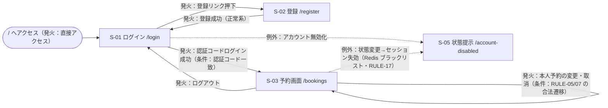
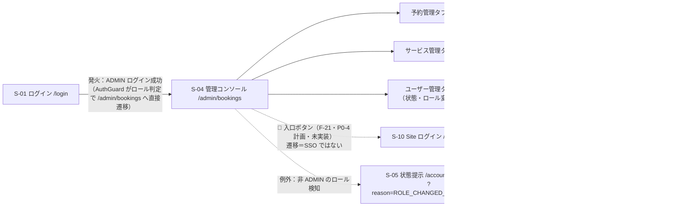

# 画面一覧・画面遷移図（基本設計）

| 項目 | 内容 |
|---|---|
| 文書ID | BD-04 |
| 版数 | V2.0（ドラフト・日本語化・雛形準拠） |
| 作成日 | 2026-08-31 |
| 対象 | Booking × Salesforce Experience Cloud 連携（基本設計フェーズ・画面一覧と画面遷移） |

## 1. 文書の位置づけと雛形対応

- 本書は P0-2 基本設計四文書の一つ（BD-04）。画面は `booking-frontend/src/pages/` の実測（2026-08-31 読取）を基準とし、Salesforce 側画面は P0-4 計画（🔵）を記載する。機能記号 F-xx は BD-02（function-list.md）を参照。
- 雛形対応：4.4 画面一覧の 8 項目＝§2 の 8 列（画面ID／画面名・概要／対応機能ID／種別／対象ロール／新規・改修／親子関係／備考）。4.5 画面遷移図の項目は §3 に対応（画面節点＝図のノード／遷移元→遷移先・発火イベント・遷移条件＝矢印ラベル／共通フレーム＝§2.1 のレイアウト行／権限制御＝§3.3／例外・戻り経路＝点線矢印）。
- 図例：✅ 既存｜🔵 P0 計画（未実装）。実装ファイルの記載は実測の証跡である。

## 2. 画面一覧

### 2.1 Booking フロントエンド（✅ 既存・Pages Router）

| 画面ID | 画面名・概要 | 対応機能ID | 種別 | 対象ロール | 新規・改修 | 親子関係 | 備考 |
|---|---|---|---|---|---|---|---|
| S-01 | ログイン：電話番号＋6 桁認証コードでログインする | F-01 | ログイン | 未認証 | 既存 | なし（トップレベル） | 実装 `pages/login.tsx` → `LoginPage.tsx`。未ログインで `/` にアクセスした場合もログインフォームを表示 |
| S-02 | 登録：電話番号＋認証コード＋氏名／メールでアカウント登録 | F-02 | 登録 | 未認証 | 既存 | なし | 実装 `pages/register.tsx` → `RegisterPage.tsx` |
| S-03 | 予約画面：サービス・時間枠の選択、予約作成・変更・取消、本人予約リストを単一ページで提供 | F-04〜F-09 | ダッシュボード（一覧・登録・更新を兼用） | **顧客（CUSTOMER）専用** | 既存 | なし | 実装 `pages/bookings.tsx` → `BookingPage.tsx`。`routePermissions.ts` で roles=`['customer']`。ADMIN のアクセスはフロントで遮断・ロール変更時は S-05 へ強制ログアウト。注意：バックエンド `/v1/bookings*` は ADMIN も許可する（フロント・バックエンドの権限口径差異点・§5 未決事項） |
| S-04 | 管理コンソール：予約管理・サービス管理・ユーザー管理の 3 タブで運用管理を提供 | F-10〜F-13（＋🔵 F-21 予定） | ダッシュボード（管理・タブ構成） | 管理者（ADMIN） | 既存（入口ボタン追加は🔵 P0-4 の改修予定） | 親（子＝3 タブ：予約管理・サービス管理・ユーザー管理） | 実装 `pages/admin/bookings.tsx` → `AdminPage.tsx`。🔵 P0-4 で「Salesforce 管理ワークベンチ」入口ボタン（F-21）を追加予定 |
| S-05 | アカウント状態提示：無効化・降格の理由を提示する例外経路画面 | F-14 | 提示（雛形種別外の特殊画面） | 全ロール（リダイレクトで到達） | 既存 | なし | 実装 `pages/account-disabled.tsx`。クエリ `?reason=ROLE_CHANGED_FROM_ADMIN` |
| — | 共通レイアウト：全画面の共通フレーム（ヘッダ・ナビゲーション） | — | 共通フレーム | — | 既存 | 全画面の親 | 実装 `components/templates/AppLayout.tsx`。上部ナビは `userType` で**グループごと切替**：一般ユーザーは「予約」、管理者は「管理コンソール」のみ（追加ではなく置換・管理者に「予約」入口はない） |

### 2.2 Salesforce Experience Site（Site 本体 ✅ P0-1 完了・画面は🔵 P0-4 計画）

| 画面ID | 画面名・概要 | 対応機能ID | 種別 | 対象ロール | 新規・改修 | 親子関係 | 備考 |
|---|---|---|---|---|---|---|---|
| S-10 | Site ログイン：外部ユーザー認証情報による独立ログイン（✅ MV-03 検証済み・ログイン部分。判定後半「権限付与済みページのみ閲覧」は MV-07 で実施） | F-22 | ログイン | 外部ユーザー（TERM-07） | 既存（Site 本体・P0-1） | なし（Site 側トップレベル） | パス `/02/login`。Booking とのセッションは完全に独立（RULE-18） |
| S-11 | 予約投影リスト：自 Account に紐づく投影（TERM-09）の読取専用一覧＋取消ボタンとコマンド状態ポーリング | F-23・F-24・F-26 | 一覧（読取専用） | 管理者（外部ユーザー・静的マッピング active） | 新規（🔵 P0-4 計画） | なし | パス `/02/s/`（独自 LWC を想定）。現サイトはサンプルテンプレートのトップページであり、P0-4 で独自 LWC に置換。行級範囲は Sharing Set により自 Account の投影のみ |

## 3. 画面遷移図

### 3.1 顧客視点（✅ 既存）

### 3.2 管理者視点（✅ 既存＋🔵 P0-4 入口）

### 3.3 アクセス制御三層（✅ 実測・反直観的事実のため原文どおり保持）

| 層 | 構成要素 | 動作 |
|---|---|---|
| Edge | Next.js `middleware.ts` | **Cookie 存在性チェックのみ**（`!!(access_token \|\| refresh_token)`）：未認証（`/admin*` を含む）→ /login へ。**ロール・権限判定は行わない** |
| クライアント | `AuthGuard`＋`routePermissions.ts` | ルート級権限の遮断：`/bookings/*` は customer のみ（ADMIN → 強制ログアウトで S-05 へ）。ログイン済みの公開パスアクセスはロールで直接遷移（admin → S-04）。`/admin*` は admin のみ |
| コンポーネント | `AdminPage` 内 `useEffect` のロール検知（`userType !== 'admin'` → storage をクリアし S-05 へリダイレクト） | 最終フォールバック。`routePermissions.ts` が `/admin/*` を admin のみと定義 |
| サーバ側 | `JwtAuthGuard`（グローバル）＋`AdminGuard`／`RolesGuard` | 最終裁定（フロント側の遮断はセキュリティ境界ではない・REQ-014・NFR-05） |

注：`withAdmin` HOC は定義済みだがリポジトリ全体に使用箇所なし（`frontend-pages-inventory.md` の結論と一致。同文書自身の番号体系は S-05=/admin/bookings など本書と異なるため参照注意。**本書の S-xx 番号を権威とする**）。

注：セッション超時は F-03 のトークン自動更新（更新不能時は S-01 への再ログイン）で対処し、二重送信は同一 commandId の初回結果返却（RULE-03・F-24/F-25 の冪等）で対処するため、本遷移図ではこれらの経路を省略している。

## 4. 遷移図の境界説明

- 点線 = システム横断遷移（ブラウザナビゲーション・SPA ルーティングではない）：S-04 → S-10 は固定 Site URL への遷移。Site のログイン状態と Booking のログイン状態は完全に独立（相互のログアウトは影響しない・パスワード/JWT/Cookie は Booking の外に出ない＝RULE-18）。
- S-11 の行級範囲：Sharing Set が Account 単位で隔離し、自 Account の投影のみ閲覧可能（F-23・MV-07・RULE-13）。
- 遷移図の 🔵 項目はすべて未実装。検証完了前に S-10/S-11 リンクを完了済みと表述しない（S-10 のログイン部分のみ例外・MV-03 注記）。

## 5. 未決事項

| No. | 未決事項 | 決定期限 |
|---|---|---|
| 1 | S-03 の権限口径差異（フロントは customer 専用・バックエンド `/v1/bookings*` は ADMIN も許可）の取り扱い方針（現状は差異の記録のみ） | 後続フェーズで確認 |
| 2 | S-11 の LWC バンドル名（P0-4 で命名・TERM-33） | P0-4 着手時 |
