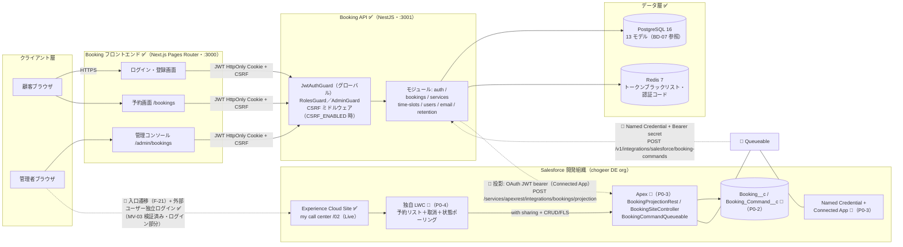

# システム構成図（基本設計）

| 項目 | 内容 |
|---|---|
| 文書ID | BD-01 |
| 版数 | V2.0（ドラフト・日本語化・雛形準拠） |
| 作成日 | 2026-08-31 |
| 対象 | Booking × Salesforce Experience Cloud 連携（基本設計フェーズ・システム構成） |

## 1. 文書の位置づけと雛形対応

- 本書は P0-2 基本設計四文書の一つ（BD-01）。Booking System（NestJS + Next.js + PostgreSQL、予約状態の正本）× Salesforce Experience Cloud（制限付き投影・取消コマンド入口）のシステム構成・デプロイ形態・4 種類の認証境界を示す。
- 機能は BD-02『機能一覧』（function-list.md）、画面は BD-04『画面一覧・画面遷移図』（screens.md）、データは BD-07『ERD』（erd.md）を参照。
- 雛形（交付物雛形集 4.1 システム構成図）の 7 項目への対応：ネットワーク・基盤＝§2.1／ハードウェア＝§2.2／OS・ミドルウェア＝§2.3／アプリケーション構成＝§2.4／外部システム接続＝§2.5／拠点・ユーザー＝§2.6／冗長化・可用性＝§2.7。
- 事実の由来：`booking-system/booking-backend/prisma/schema.prisma`、`booking-backend/package.json`、`booking-frontend/package.json`、`booking-deploy/compose/docker-compose.dev.yml`、`booking-backend/Dockerfile`、`booking-frontend/Dockerfile`、`booking-backend/docs/api-contract.md`（いずれも 2026-08-31 読取による実測）。Salesforce 側は chogeer 開発組織（DE org）の実測（P0-1 完了・MV-03 検証済み）に基づく。
- 状態表記：✅ = 既存実装・稼働中。🔵 = P0 計画（未実装・P0-2/P0-3/P0-4 に依存）。⚪ = P1。Salesforce 連携部分は特記のない限り 🔵。
- 真実性原則：本構成はデモ規模である。生産級の台数・冗長・SLA を前提とした記載は行わない（§2.2・§2.7 に明記）。

## 2. システム構成図

実線 = 既存実装済みのリンク。点線 = P0 計画のリンク（未実装）。Queueable は BookingSiteController がコマンド作成トランザクション内で `System.enqueueJob` により起動する（P0-3 実装時に確定）。

## 3. 基盤構成（雛形 7 項目）

### 3.1 ネットワーク・基盤

| 項目 | 構成 | 状態 |
|---|---|---|
| Booking フロントエンド | ローカルホスト :3000（Next.js） | ✅ |
| Booking API | ローカルホスト :3001（NestJS・グローバルプレフィックス `/v1`） | ✅ |
| PostgreSQL | ローカルホスト :5432（Docker ボリュームで永続化） | ✅ |
| Redis | ローカルホスト :6379 | ✅ |
| Salesforce | クラウド側の開発組織（chogeer DE org）。Site `my call center`（パス /02・Live）`https://softcode-dev-ed.develop.my.site.com/02` | ✅（P0-1 完了） |

- 本構成はローカルホスト中心の開発・デモ用途構成であり、本番稼働を前提としない。DMZ などのネットワーク区域分割・VPN・帯域設計は本デモの対象外（単一ホスト内の localhost 通信が主体）。
- デプロイ形態 ✅：`booking-deploy` の compose（5 サービス＝postgres / redis / migration / backend / frontend）。migration は `prisma migrate deploy` を実行して終了する初期化コンテナ。

### 3.2 ハードウェア

- 開発機 1 台（Windows x64・本書執筆環境の実測）上の Docker Compose で全コンポーネントを稼働。サーバ機・クラウドインフラ（VM・ロードバランサ等）は不使用。
- Salesforce 側は Salesforce 提供クラウド上の開発組織（DE org・無償開発枠）のみを使用。
- デモ規模の正直な記載：生産級の台数設計・性能設計は本件の前提に含まない（RD-02 の測定規模の前提と一致）。

### 3.3 OS・ミドルウェア（実測バージョン）

| 区分 | 構成要素 | バージョン（実測・出典） |
|---|---|---|
| 実行基盤 | Node.js（バックエンド・フロント共通の Docker ベースイメージ） | 22（`node:22-bookworm-slim`・両 Dockerfile 実測） |
| AP フレームワーク | NestJS | ^10.0.0（@nestjs/common 等・`booking-backend/package.json`。platform-socket.io / websockets は ^10.4.20） |
| ORM | Prisma（prisma / @prisma/client） | ^6.16.2（同上） |
| 言語 | TypeScript | バックエンド ^5.1.3・フロントエンド ^5（各 package.json） |
| Web フロントエンド | Next.js（Pages Router） | 15.5.3（固定バージョン・`booking-frontend/package.json`） |
| UI ライブラリ | React / React DOM | 19.1.0（固定バージョン・同上） |
| CSS | Tailwind CSS | ^4（同上） |
| DB | PostgreSQL | 16（イメージ `postgres:16`・`docker-compose.dev.yml` 実測） |
| KVS | Redis | 7（イメージ `redis:7-alpine`・同上） |
| リアルタイム通信 | socket.io | ^4.8.1（`booking-backend/package.json`） |

注：依存バージョンは package.json の宣言値。`^` 付きは範囲宣言であり、実際に解決されるバージョンは各リポジトリの package-lock.json に依存する（本書では宣言値を記載）。

### 3.4 アプリケーション構成

- 3 層構成：プレゼンテーション層（Next.js・Pages Router：S-01〜S-05）／アプリケーション層（NestJS モジュール群：§5）／データアクセス層（Prisma → PostgreSQL・トークン/認証コードは Redis）。
- デプロイ単位：フロントエンド・バックエンド・DB・KVS・migration の 5 コンテナ（§3.1 のデプロイ形態）。
- Salesforce 側の構成は §6（🔵 除く P0 計画）。
- 共通ガード・アクセス制御は §4（A1〜A4）と BD-04 §3.3（フロント三層）を参照。

### 3.5 外部システム接続

| 方向 | 接続先・内容 | 方式・プロトコル | 認証 | 状態 |
|---|---|---|---|---|
| Booking → Salesforce | 予約投影（正本変更の冪等 Upsert・TERM-09）。Apex REST `POST /services/apexrest/integrations/bookings/projection` | HTTPS（Apex REST） | OAuth 2.0 JWT Bearer（Connected App・A2） | 🔵 P0-3 計画 |
| Salesforce → Booking | 取消コマンド実行（CANCEL_BOOKING のみ・TERM-11）。`POST /v1/integrations/salesforce/booking-commands` | HTTPS（REST） | Named Credential（Bearer secret）＋ Integration Guard（A3） | 🔵 P0-3 計画 |
| 管理者ブラウザ → Salesforce | 入口ボタンからの Site ログインページ遷移＋外部ユーザー独立ログイン（遷移＝SSO ではない） | HTTPS（ブラウザ） | Salesforce 外部ユーザー認証情報（A4） | 遷移 🔵 P0-4 計画／ログイン ✅ MV-03 検証済み（ログイン部分） |

責任分界：予約状態の最終値は常に Booking のトランザクションが決定する。Salesforce は投影の表示とコマンドの受理のみを担い、正本を直接書き換えない（RD-07 §5 と一致）。

### 3.6 拠点・ユーザー

| 対象 | 内容 |
|---|---|
| 開発者 | 単一開発者（ローカルホストのブラウザから Booking にアクセス） |
| デモユーザー | 顧客（CUSTOMER・TERM-05）数名、管理者（ADMIN・TERM-06）1 名、Salesforce 外部ユーザー（TERM-07）1 名（事前設定） |
| 拠点 | 単一拠点（開発機 1 台）。複数拠点・モバイル端末の考慮は対象外 |

### 3.7 冗長化・可用性（デモ級の明記）

- **単一構成・冗長化なし**：PostgreSQL・Redis・Booking API・フロントエンドはいずれも単一インスタンス。フェイルオーバー・バックアップノード・ロードバランサは存在しない。
- 可用性率の数値目標（RTO/RPO を含む）は設定しない（NFR-10）。障害時は手動再起動（`compose restart`）で復旧する。
- Salesforce 側も単一開発組織に依存（生産 org・バックアップ org なし）。
- 生産展開時は本構成を再協議する（RD-07 §6 前提条件 6 と一致）。

## 4. 認証境界（4 種類・混用禁止）

| # | 主体 → 対象 | 仕組み | 状態 | 備考 |
|---|---|---|---|---|
| A1 | 顧客／管理者 → Booking API | 電話番号＋6 桁認証コード（TERM-31）でログイン → `access_token`/`refresh_token`/`csrf_token` を HttpOnly Cookie で発行。JWT グローバルガードがリクエストごとに検証し、Redis ブラックリスト（ログアウト・無効化・リフレッシュ失効）を確認。ロールはデータベースの値を毎回参照（jwt-auth.guard 実測） | ✅ | ロール変更は `PUT /v1/users/:id`（既存セッションを取り消さない＝P1 強化課題・RULE-17）。状態変更 `PUT /v1/users/:id/status` はセッションを取り消す |
| A2 | Booking サービス → Salesforce | OAuth 2.0 JWT Bearer：専用 Connected App＋integration user＋`api` scope。証明書秘密鍵は Booking 側 secret 管理（TERM-20） | 🔵 P0-3 | 技術選定の根拠は tech-decisions（Flow／標準 REST 代替は評価のうえ否決） |
| A3 | Salesforce Queueable → Booking API | Named Credential（External Credential の Bearer principal・TERM-21）＋ Booking 側 Integration Guard（secret の鍵バージョン・audience・scope=`booking.integration.command`・時刻偏差を検証・TERM-23） | 🔵 P0-3 | JWT ガードを迂回した匿名エンドポイントにはしない |
| A4 | 管理者 → Experience Site | Booking ログイン後、入口ボタンから Site ログインページへ遷移し、Salesforce 外部ユーザー認証情報で**独立ログイン**。Booking のパスワード／JWT／Cookie は Booking の外に出ない（RULE-18） | 遷移 🔵（P0-4）／ログイン ✅（MV-03 検証済み・ログイン部分） | 遷移＝SSO ではない。両者のログアウトは相互に独立 |

サービス間認証（A2/A3）は「どのシステムが API を呼べるか」を決め、ユーザー認証（A1/A4）は「誰がコマンドを提出できるか」を決める。両者は分離する（REQ-029）。

## 5. Booking API モジュール構成（✅ 実測）

| モジュール | 用途 | 備考 |
|---|---|---|
| auth | 認証コードログイン・登録・リフレッシュ・ログアウト・JWT Cookie 発行 | F-01〜F-03 |
| bookings | 予約 CRUD・取消・日付／ユーザー条件照会・統計 | 取消端点 `PATCH /v1/bookings/:id/cancel`（F-06〜F-08）。競合時は直列化＋限定リトライ（P2034） |
| services / time-slots | サービスカタログと予約枠（TERM-02/03）管理・空き照会 | 枠容量は現状ハードコード値 1（`getAvailability` の `maxCapacity=1`・RULE-06） |
| users | ユーザー CRUD・状態／ロール変更・アバター画像 | ロール変更はセッション維持（§4 A1 参照・F-12） |
| email | 予約確認・取消メール（非同期送信） | F-08 の取消確認メール |
| retention | 期限切れ予約データの周期削除 | **CANCELLED/COMPLETED を 30 日でハードデリート**（BIZ-16・RULE-15・REQ-032 ✅）。投影との関係は BD-07 §3 参照 |
| prisma | PrismaClient のグローバルラッパ | 実装は `src/common/prisma` |

ガードとミドルウェア：`JwtAuthGuard`（APP_GUARD でグローバル登録）、`RolesGuard`、`AdminGuard`、`WsJwtGuard`、CSRF ミドルウェア（`CSRF_ENABLED=true` の場合のみ登録）。

注：`api-contract.md` 記載の `/v1/system/*` 端点群（設定・レポート）は `SystemModule` が `AppModule` にインポートされておらず**現状呼び出し不可**。本書では構成要素として扱わない（契約文書からの復元は行わないこと）。`GET /v1/health`・`GET /v1/upload/stats` は運用補助端点であり機能一覧には単独立項しない。

## 6. Salesforce 側構成（🔵 特記のない限り P0 計画）

| 構成要素 | 用途 | 状態・依存段階 |
|---|---|---|
| Experience Cloud Site `my call center`（/02） | 制限付き外部入口（TERM-19） | ✅ Live（P0-1 完了） |
| 外部ユーザー＋Profile/Permission Set＋Sharing Set | 管理者の身元と行級範囲（External OWD=Private・Account 隔離・TERM-32） | ✅ 外部ユーザー 1 名作成済み（P0-1）／権限マトリクス 🔵 P0-2 で凍結（F-32） |
| `Booking__c` / `Booking_Command__c`＋External ID＋version フィールド | 投影オブジェクト（TERM-09）とコマンドオブジェクト（TERM-11） | 🔵 P0-2 契約凍結 |
| `BookingProjectionRest` / `BookingSiteController` / `BookingCommandQueueable` | 投影受入口（TERM-24）／Site 用コントローラ（TERM-25）／バックグラウンド呼出（TERM-22） | 🔵 P0-3（Flow／標準 REST による代替は評価のうえ否決済み） |
| Connected App（JWT Bearer）＋integration user＋Named Credential | 双方向のサービス間認証（A2/A3） | 🔵 P0-3 |
| 独自 LWC（予約リスト・取消ボタン・コマンド状態ポーリング・TERM-33） | Site 制限ページ | 🔵 P0-4（現サイトはサンプルテンプレート） |
| Outbox/Worker・動的 provisioning（提権・降権） | 信頼性配信と外部ユーザーのライフサイクル管理 | ⚪ P1（REQ-037・REQ-038 保留） |

## 7. 未決事項

| No. | 未決事項 | 決定期限 |
|---|---|---|
| 1 | 【決定済 2026-09-02】NC 最終指向＝booking-deploy デプロイ環境の公網 HTTPS URL（CHK-02 C-1・方案 1+3）。S-2 設定時は仮値（tunnel／プレースホルダ HTTPS・P0-3 内に実 callout なし）を許容し、P0-4 実リンク検証前に公網デプロイ完了・切替・接続確認を行う | 決定済み（2026-09-02） |
| 2 | 【決定済 2026-09-01】External ID＝uuid `id` に決定（TERM-14。BD-07 §6 未決 1 と同日クローズ。本書では扱わない方針は維持） | 決定済み（2026-09-01） |
