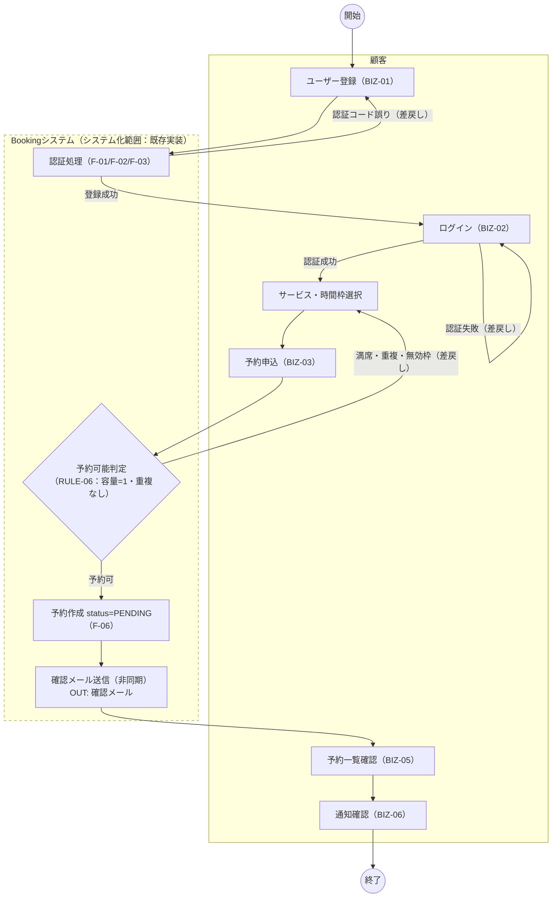
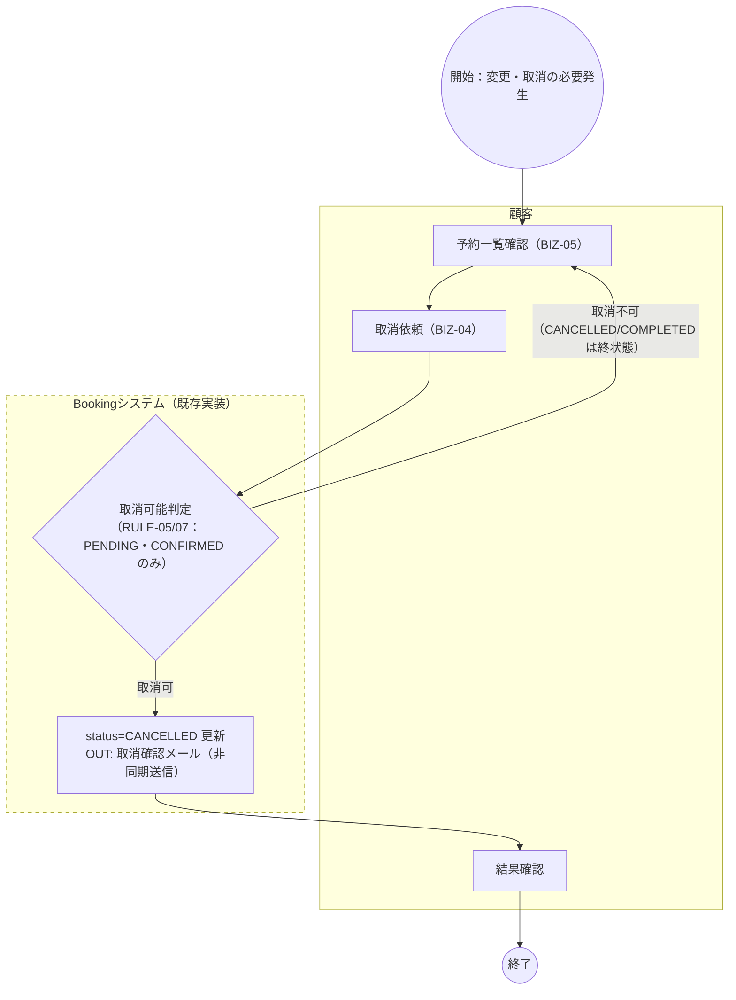
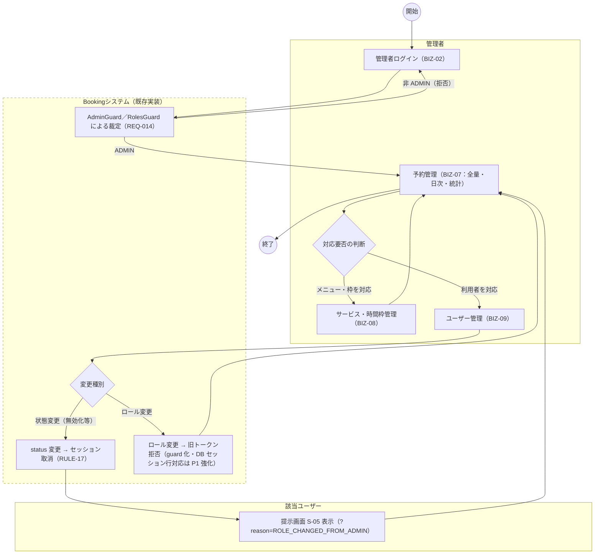
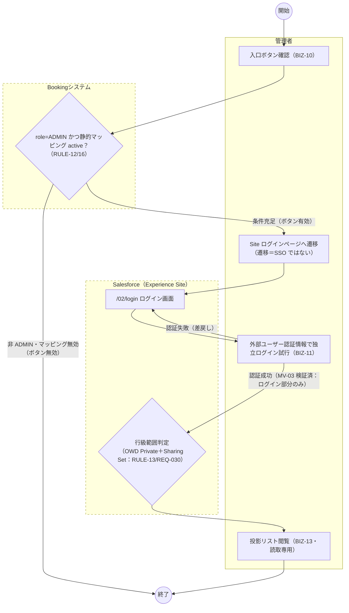
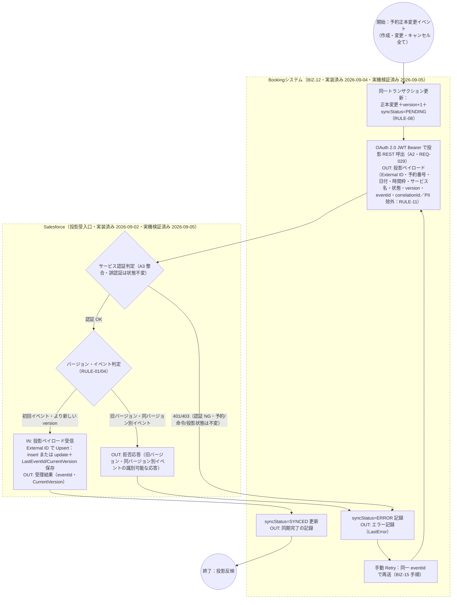
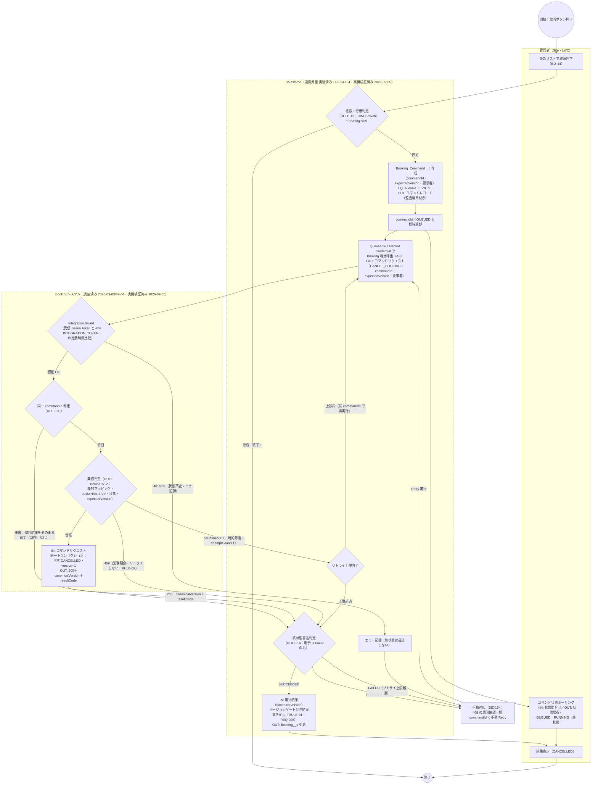
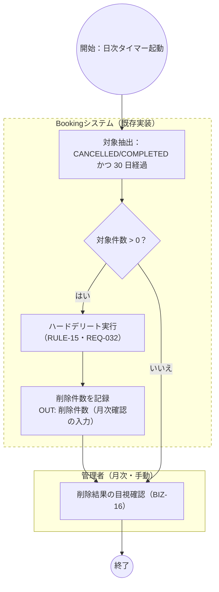

# 業務フロー

| 項目 | 内容 |
|---|---|
| 文書ID | RD-04 |
| 版数 | V1.3（2026-09-05・P0-4 Step 5 回写：図 6 の Salesforce 側サブグラフラベルを実装済へ更新。前版 V1.2＝ドラフト・2026-09-03 C-2 修订） |
| 作成日 | 2026-08-31 |
| 対象 | Booking × Salesforce Experience Cloud 連携（要件定義フェーズ） |

## 1. 文書の目的と表記規約

業務一覧（RD-03）で切り出した業務（BIZ-01〜BIZ-16）をフロー図として可視化する。時系列の相互作用の詳細は『業務時序図』（docs/asset/requirement-definition-draft/interview-portfolio-business-sequence.md）を補助資料とし、本書はフロー（分岐・例外・差戻し）を主役とする。

- 泳道：`subgraph` で役割別に分割（顧客／Bookingシステム／管理者／Salesforce）。
- 開始・終了イベント：二重括弧 `(( ))` で表記。
- 分岐条件：分岐線上にラベル表記。
- 入出力帳票・データ：主要な I/O ノードには `IN:`（入力・受信データ）／`OUT:`（出力・送信データ）のラベルを付記し、対象（API ペイロード・メール・コマンドレコード・削除件数等）を明記する。帳票・データのやり取りがない UI 遷移のみの図（図 3・図 4）では付記しない。
- 点線枠：`style ... stroke-dasharray` = システム化範囲の境界（枠内が今回システム化対象）。
- 記載状態の注記：実装状態は図内ラベルに「既存実装」「P0-3 計画・未着手」等の文字表記で明記する（✅／🔵 等の記号は使用しない）。
- 記載内容の注記：計画中の図は設計目標であり、実装済みではない。

## 2. 図 1：顧客予約系—登録・ログイン・予約作成（BIZ-01〜BIZ-03、BIZ-05、BIZ-06）

## 3. 図 2：顧客予約系—変更・キャンセル（BIZ-04）

## 4. 図 3：管理者系—予約管理・サービス管理・ユーザー管理（BIZ-07〜BIZ-09）

## 5. 図 4：入口・独立ログイン・投影照会（BIZ-10、BIZ-11、BIZ-13）

> 注：図 4 の Bookingシステム側判定・Salesforce 側 LWC 表示は実装済み（P0-3/P0-4・実機検証済み 2026-09-05）。Site 本体・外部ユーザーログイン部分（MV-03）に加え、閲覧範囲限定（MV-07）も実機検証済み。

## 6. 図 5：予約投影（BIZ-12、Booking → Salesforce）

> 注：顧客自身の標準取消操作（BIZ-04）も同一の正本状態遷移を通り、本図の投影経路で同期される。差戻し（ERR5→RETRY5）は P0 の手順ベースの手動対応。

## 7. 図 6：予約キャンセルコマンド（BIZ-14、BIZ-15・Salesforce → Booking）

> 注：409（CONFLICT）と 503（FAILED）の差戻し経路は本図の必須経路である。409 は自動リトライせず人間が判断（BIZ-15）、503 は同一 commandId で限定回数の自動リトライ。権限拒否（PERM6 の「拒否」）はコマンド生成前に終了する。

## 8. 図 7：予約データ保持・消去（BIZ-16）

> 注：投影レコード（Booking__c）は正本クリーンアップの対象外とする方針（G7・P0-2 決定事項／REQ-033）。削除済み予約への遅延コマンドは 404/409 でフォールバックする。

## 9. 図と業務・要件の対応総括

| 図 | 対象業務 | 主要要件 |
|---|---|---|
| 図 1 | BIZ-01〜BIZ-03、BIZ-05、BIZ-06 | REQ-001〜REQ-006、REQ-007、REQ-009 |
| 図 2 | BIZ-04 | REQ-008 |
| 図 3 | BIZ-07〜BIZ-09 | REQ-010、REQ-011、REQ-012、REQ-013、REQ-014、REQ-015 |
| 図 4 | BIZ-10、BIZ-11、BIZ-13 | REQ-016、REQ-017、REQ-020、REQ-026、REQ-030 |
| 図 5 | BIZ-12 | REQ-018、REQ-019、REQ-024、REQ-029、REQ-031 |
| 図 6 | BIZ-14、BIZ-15 | REQ-021〜REQ-028、REQ-030、REQ-031 |
| 図 7 | BIZ-16 | REQ-032、REQ-033 |
