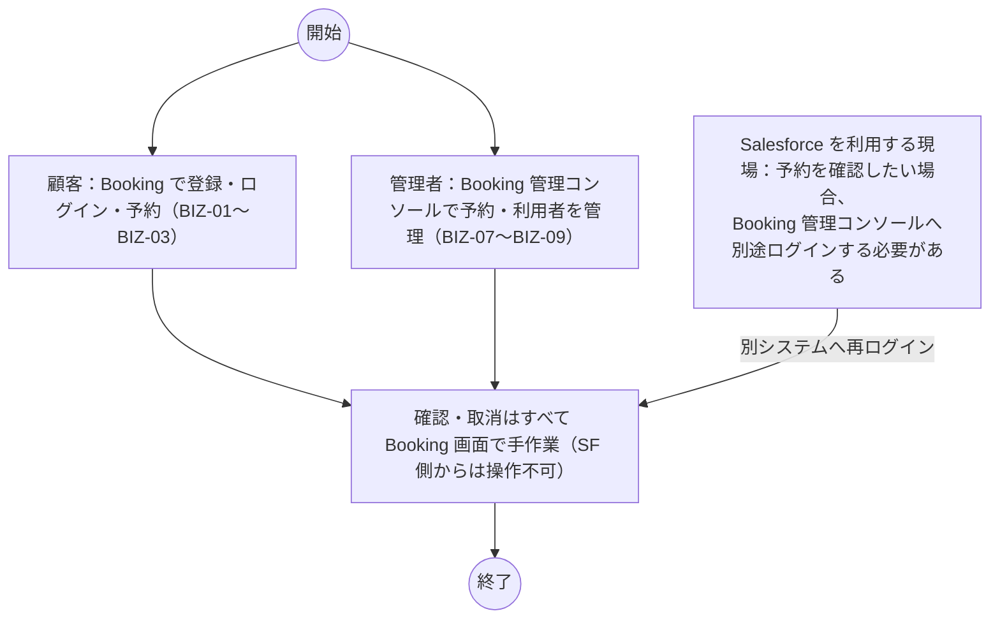
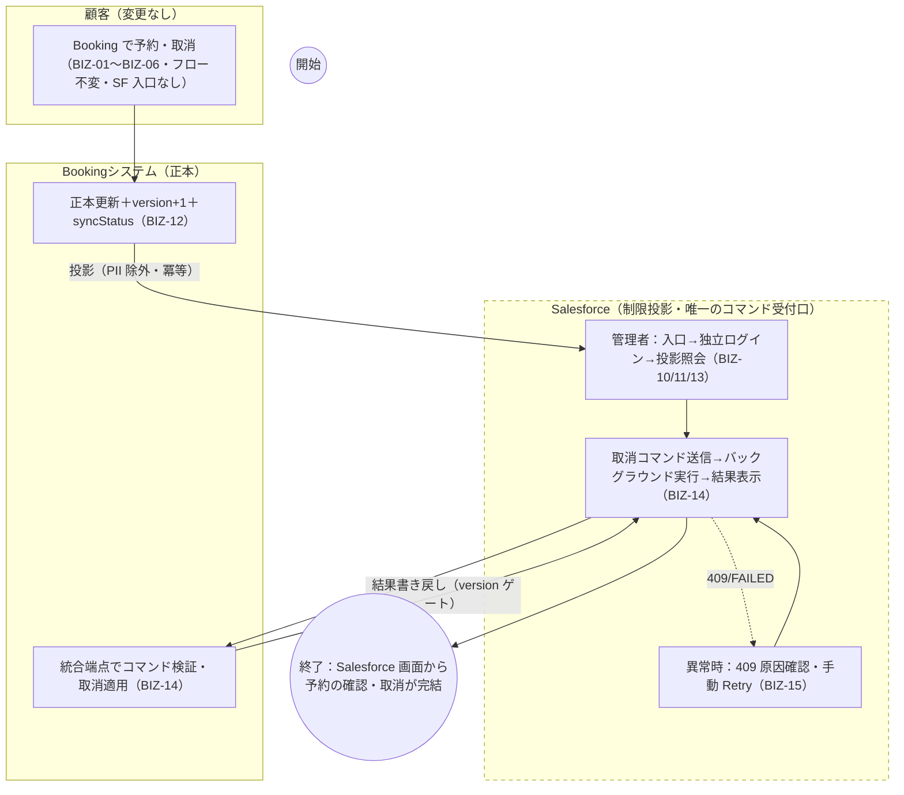

# To-Be 業務モデルと現状課題

| 項目 | 内容 |
|---|---|
| 文書ID | RD-08 |
| 版数 | V1.1（ドラフト・独立再レビュー指摘反映） |
| 作成日 | 2026-08-31 |
| 対象 | Booking × Salesforce Experience Cloud 連携（要件定義フェーズ） |

## 1. 現状（As-Is）フロー

予約業務は **Booking System 単体で完結**している（2026-08-31 実測ベース）。

- 予約の作成・変更・取消・照会・通知は全て Booking 画面（S-01〜S-05）で完結し、Salesforce との接点は存在しない（Booking フロント・バックエンドに Salesforce 参照なし）。
- Salesforce を業務基盤とする立場からは、予約の確認・操作のために**確認のたびに別システム（Booking）へログインする**必要がある。
- 連携がないため、相関 ID・監査証跡・投影の一貫性管理も存在しない。
- なお Experience Site 自体は構成済み（Site Live・外部ユーザー 1 名のログインは検証済）であるが、予約アセット（Booking__c 等）は未作成であり業務利用には至っていない。

## 2. 課題一覧

> 影響度の評価に関する注記：本表の影響度（高／中／低）は定性評価である。本件はデモプロジェクトであり実測の作業時間・件数データが存在しないため、真実性原則に従い定量値を捏造せず、「現行フロー上の反復頻度」と「必須手順の多さ」を判定根拠とする。

| 課題ID | 課題内容 | 影響度 | 判定根拠 | 改善方針（To-Be） | 対応要件ID |
|---|---|---|---|---|---|
| ISS-01 | システム間の情報分断：Salesforce 利用現場から予約を確認できず、確認のたびに Booking へ別ログインが必要。同一情報を 2 システムで目視照合する状態 | 高 | 確認のたびに別ログイン＋目視照合が発生（現行フロー上の必須手順）。日次予約運用（BIZ-07）のたびに反復する | 管理者が Experience Site 独立ログイン後に予約投影（Booking__c）を閲覧できる。Booking の機密は持ち出さない | REQ-016, REQ-017, REQ-018, REQ-020 |
| ISS-02 | 対応の滞留：取消・対応が Booking 画面操作のみで、Salesforce 側から直接働きかけられない。確認→連絡→Booking 操作の多段作業になる | 中 | 取消 1 件に「確認→依頼→Booking 操作」の複数ステップが発生し得る（BIZ-04 と BIZ-07 の往復） | Site から CANCEL_BOOKING を送信し、Booking が正本を検証のうえ取消・結果を書き戻す | REQ-021, REQ-022, REQ-025 |
| ISS-03 | 証跡・追跡性の欠如：連携記録（相関 ID・試行回数・エラー内容）がなく、問題発生時の原因特定ができない | 中 | 連携導入時に失敗（409/503/認証エラー）の記録先が存在しない。データ整合の確認手段が目視のみ | CorrelationId・AttemptCount・LastError・HttpStatus をコマンド／投影に記録し、409/503 を区分管理 | REQ-027, REQ-031 |
| ISS-04 | 個人情報の管理リスク：連携を単純に導入すると顧客の氏名・電話等が外部システムへ安易に流れ得る。統制方針が未定義 | 高 | 連携対象項目の原則が存在せず、導入時に PII が同期対象に含まれるリスクが常在 | 投影ホワイトリスト（PII 5 項目除外）を契約凍結し、Salesforce 側では行級限定・最小権限とする | REQ-019, REQ-030 |
| ISS-05 | データ権威の不明瞭化リスク：双方向に自由編集を許すと正本が不明瞭になり、二重管理・矛盾が発生し得る | 中 | 外部連携の一般的な失敗様式。現状は連携自体がないため潜在リスク | Booking を正本・Salesforce を制限投影とする境界原則を要件化（version 単調性・投影専用書込・終状態は明示応答のみ反映） | REQ-018, REQ-024, REQ-025, REQ-036 |
| ISS-06 | 権限越境リスク：誰がコマンドを実行したかの特定方法が未定義のまま連携を始めると、越権操作・偽装が可能になる | 高 | 操作者特定の仕組み（マッピング・行級範囲）が連携前に存在しない | 静的操作者マッピング（サーバ側確定・ブラウザ申告不採用）＋OWD Private＋Sharing Set＋CRUD/FLS＋サービス間認証分離 | REQ-014, REQ-026, REQ-029, REQ-030 |
| ISS-07 | 障害復旧が暫定的：P0 の直接呼出＋有限リトライは本番級の信頼性配信（自動照合・指標告警）を持たず、失敗時の復旧は人手に依存 | 低〜中 | Outbox/Worker/DLQ 未導入（P0 計画範囲外）。デモ規模では許容だが、失敗件数が増えると人手負担が線形に増える | P0：409/503 の区分＋手動 Retry（原 commandId）で最低限の復旧手段を確保。本番級機構は **今回未対応**（P1 保留と明示） | REQ-027, REQ-028（対応）／REQ-037（今回未対応・P1） |
| ISS-08 | 利用者ライフサイクル運用の非自動：外部ユーザーの権限付与・剥奪が手作業（事前設定 1 名）。提権降権のたびに Salesforce 管理作業が発生 | 低 | P0 は管理者 1 名のみで、変更頻度が極めて低い。動的化の設計は存在するが実装価値が現時点で小さい | **今回未対応**。動的 provisioning（SalesforceUserLink・sfAccessStatus）は P1 の設計目標として明示し、実装済みとは扱わない | REQ-038（今回未対応・P1） |

## 3. To-Be 業務モデル（全体像）

To-Be の要点：

1. 顧客の操作フローは一切変わらない（Salesforce 入口なし）。
2. 管理者は Salesforce 画面だけで「確認→取消→結果確認」を完結でき、別ログインは Site ログイン 1 回のみ。
3. 予約状態の最終決定権は常に Booking にあり、Salesforce は投影の閲覧と CANCEL_BOOKING の送信のみ。
4. 失敗は 409（業務競合・リトライせず人間が判断）と 503（一時的障害・限定リトライ）に区分され、証跡（CorrelationId 等）で追跡できる。

## 4. 課題と対策の対応総括

| 課題ID | 対策の有無 | 対応要件ID | 備考 |
|---|---|---|---|
| ISS-01 | 対応する | REQ-016, REQ-017, REQ-018, REQ-020 | 本件の主目的（REQ-019 は PII 統制として ISS-04 に対応） |
| ISS-02 | 対応する | REQ-021, REQ-022, REQ-025 | CANCEL_BOOKING のみ（改期等は対象外） |
| ISS-03 | 対応する | REQ-027, REQ-031 | 監査フィールド＋エラー区分 |
| ISS-04 | 対応する | REQ-019, REQ-030 | PII ホワイトリスト＋行級権限 |
| ISS-05 | 対応する | REQ-018, REQ-024, REQ-025, REQ-036 | 正本／投影境界の原則化 |
| ISS-06 | 対応する | REQ-014, REQ-026, REQ-029, REQ-030 | マッピング＋最小権限＋認証分離 |
| ISS-07 | 部分対応（残りは今回未対応） | REQ-027, REQ-028 ／ REQ-037（P1） | P0 の限界を明示 |
| ISS-08 | 今回未対応 | REQ-038（P1） | 設計目標のみ・実装は後工程 |

> 真実性の注記：To-Be は設計目標である。REQ-016 のログイン部分のみ検証済で、投影・コマンド・LWC は未着手（P0-2〜P0-4 計画）。検証完了前に「実現済み」と表現することはしない。
